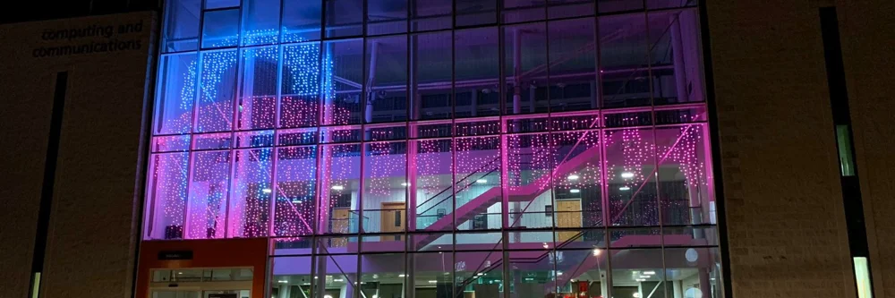

---

# What is LUHack?

- The society for anyone interested in cyber security\, no matter their skill level\.
- Weekly sessions teaching ethical hacking\.
- Member’s only access to custom lab machines to practice on\, and access to on\-demand Kali VMs\.
- Join our competitive hacking team and compete in CTFs
- Free (just turn up)!

---

# Where is LUHack?

Find us on our website at [scc-luhack.lancs.ac.uk](https://scc-luhack.lancs.ac.uk).

Chat on discord at [luhack.uk/discord](https://luhack.uk/discord).

Weekly meetings will be in the sky lounge of the Infolab \(big teal building next to pendle\)\, every friday\, 5\-7pm\.

---

# Get started

<a id="big" href="https://luhack.uk/start">luhack.uk/start</a>

<svg viewBox="0 0 37 37" fill="#000" shape-rendering="crispEdges" xmlns="http://www.w3.org/2000/svg" version="1.1"><path fill="#ffffff" d="M0,0V37H37V0H0Z"></path><path transform="matrix(1,0,0,1,4,4)" d="M23,28h2v1h-2v-1zM17,28h5v1h-5v-1zM12,28h3v1h-3v-1zM10,28h1v1h-1v-1zM0,28h7v1h-7v-1zM28,27h1v1h-1v-1zM24,27h3v1h-3v-1zM21,27h2v1h-2v-1zM16,27h3v1h-3v-1zM14,27h1v1h-1v-1zM9,27h1v1h-1v-1zM6,27h1v1h-1v-1zM0,27h1v1h-1v-1zM27,26h2v1h-2v-1zM23,26h2v1h-2v-1zM20,26h2v1h-2v-1zM17,26h1v1h-1v-1zM15,26h1v1h-1v-1zM13,26h1v1h-1v-1zM11,26h1v1h-1v-1zM6,26h1v1h-1v-1zM2,26h3v1h-3v-1zM0,26h1v1h-1v-1zM26,25h2v1h-2v-1zM23,25h1v1h-1v-1zM16,25h3v1h-3v-1zM10,25h3v1h-3v-1zM8,25h1v1h-1v-1zM6,25h1v1h-1v-1zM2,25h3v1h-3v-1zM0,25h1v1h-1v-1zM27,24h2v1h-2v-1zM17,24h8v1h-8v-1zM14,24h2v1h-2v-1zM10,24h1v1h-1v-1zM8,24h1v1h-1v-1zM6,24h1v1h-1v-1zM2,24h3v1h-3v-1zM0,24h1v1h-1v-1zM27,23h2v1h-2v-1zM24,23h2v1h-2v-1zM18,23h3v1h-3v-1zM12,23h3v1h-3v-1zM6,23h1v1h-1v-1zM0,23h1v1h-1v-1zM26,22h1v1h-1v-1zM24,22h1v1h-1v-1zM22,22h1v1h-1v-1zM17,22h4v1h-4v-1zM14,22h2v1h-2v-1zM11,22h2v1h-2v-1zM8,22h1v1h-1v-1zM0,22h7v1h-7v-1zM24,21h3v1h-3v-1zM20,21h1v1h-1v-1zM15,21h1v1h-1v-1zM13,21h1v1h-1v-1zM8,21h3v1h-3v-1zM28,20h1v1h-1v-1zM26,20h1v1h-1v-1zM19,20h6v1h-6v-1zM15,20h3v1h-3v-1zM12,20h1v1h-1v-1zM5,20h6v1h-6v-1zM0,20h2v1h-2v-1zM26,19h3v1h-3v-1zM18,19h5v1h-5v-1zM15,19h2v1h-2v-1zM11,19h1v1h-1v-1zM8,19h2v1h-2v-1zM4,19h2v1h-2v-1zM0,19h3v1h-3v-1zM28,18h1v1h-1v-1zM25,18h1v1h-1v-1zM18,18h2v1h-2v-1zM14,18h2v1h-2v-1zM12,18h1v1h-1v-1zM9,18h2v1h-2v-1zM6,18h1v1h-1v-1zM0,18h3v1h-3v-1zM23,17h4v1h-4v-1zM16,17h6v1h-6v-1zM13,17h2v1h-2v-1zM3,17h3v1h-3v-1zM0,17h2v1h-2v-1zM27,16h1v1h-1v-1zM25,16h1v1h-1v-1zM23,16h1v1h-1v-1zM19,16h1v1h-1v-1zM16,16h2v1h-2v-1zM8,16h2v1h-2v-1zM6,16h1v1h-1v-1zM2,16h2v1h-2v-1zM0,16h1v1h-1v-1zM24,15h4v1h-4v-1zM21,15h1v1h-1v-1zM18,15h1v1h-1v-1zM16,15h1v1h-1v-1zM12,15h1v1h-1v-1zM9,15h1v1h-1v-1zM1,15h4v1h-4v-1zM28,14h1v1h-1v-1zM25,14h1v1h-1v-1zM21,14h3v1h-3v-1zM18,14h2v1h-2v-1zM15,14h1v1h-1v-1zM13,14h1v1h-1v-1zM8,14h4v1h-4v-1zM6,14h1v1h-1v-1zM2,14h2v1h-2v-1zM28,13h1v1h-1v-1zM26,13h1v1h-1v-1zM24,13h1v1h-1v-1zM22,13h1v1h-1v-1zM14,13h4v1h-4v-1zM10,13h2v1h-2v-1zM7,13h2v1h-2v-1zM3,13h1v1h-1v-1zM0,13h2v1h-2v-1zM27,12h1v1h-1v-1zM25,12h1v1h-1v-1zM21,12h2v1h-2v-1zM16,12h4v1h-4v-1zM10,12h5v1h-5v-1zM6,12h3v1h-3v-1zM0,12h3v1h-3v-1zM28,11h1v1h-1v-1zM15,11h5v1h-5v-1zM10,11h4v1h-4v-1zM4,11h1v1h-1v-1zM2,11h1v1h-1v-1zM0,11h1v1h-1v-1zM25,10h1v1h-1v-1zM20,10h3v1h-3v-1zM17,10h1v1h-1v-1zM13,10h1v1h-1v-1zM10,10h1v1h-1v-1zM8,10h1v1h-1v-1zM5,10h2v1h-2v-1zM3,10h1v1h-1v-1zM27,9h1v1h-1v-1zM23,9h2v1h-2v-1zM21,9h1v1h-1v-1zM12,9h8v1h-8v-1zM9,9h2v1h-2v-1zM0,9h3v1h-3v-1zM25,8h2v1h-2v-1zM19,8h2v1h-2v-1zM14,8h2v1h-2v-1zM12,8h1v1h-1v-1zM9,8h1v1h-1v-1zM6,8h2v1h-2v-1zM3,8h2v1h-2v-1zM17,7h3v1h-3v-1zM13,7h1v1h-1v-1zM9,7h1v1h-1v-1zM22,6h7v1h-7v-1zM20,6h1v1h-1v-1zM18,6h1v1h-1v-1zM16,6h1v1h-1v-1zM14,6h1v1h-1v-1zM12,6h1v1h-1v-1zM10,6h1v1h-1v-1zM8,6h1v1h-1v-1zM0,6h7v1h-7v-1zM28,5h1v1h-1v-1zM22,5h1v1h-1v-1zM20,5h1v1h-1v-1zM14,5h3v1h-3v-1zM11,5h2v1h-2v-1zM6,5h1v1h-1v-1zM0,5h1v1h-1v-1zM28,4h1v1h-1v-1zM24,4h3v1h-3v-1zM22,4h1v1h-1v-1zM18,4h2v1h-2v-1zM14,4h3v1h-3v-1zM12,4h1v1h-1v-1zM9,4h2v1h-2v-1zM6,4h1v1h-1v-1zM2,4h3v1h-3v-1zM0,4h1v1h-1v-1zM28,3h1v1h-1v-1zM24,3h3v1h-3v-1zM22,3h1v1h-1v-1zM20,3h1v1h-1v-1zM16,3h2v1h-2v-1zM13,3h1v1h-1v-1zM8,3h3v1h-3v-1zM6,3h1v1h-1v-1zM2,3h3v1h-3v-1zM0,3h1v1h-1v-1zM28,2h1v1h-1v-1zM24,2h3v1h-3v-1zM22,2h1v1h-1v-1zM18,2h3v1h-3v-1zM15,2h2v1h-2v-1zM12,2h1v1h-1v-1zM10,2h1v1h-1v-1zM8,2h1v1h-1v-1zM6,2h1v1h-1v-1zM2,2h3v1h-3v-1zM0,2h1v1h-1v-1zM28,1h1v1h-1v-1zM22,1h1v1h-1v-1zM18,1h3v1h-3v-1zM14,1h3v1h-3v-1zM11,1h1v1h-1v-1zM9,1h1v1h-1v-1zM6,1h1v1h-1v-1zM0,1h1v1h-1v-1zM22,0h7v1h-7v-1zM18,0h3v1h-3v-1zM16,0h1v1h-1v-1zM13,0h1v1h-1v-1zM11,0h1v1h-1v-1zM9,0h1v1h-1v-1zM0,0h7v1h-7v-1z"></path></svg>

