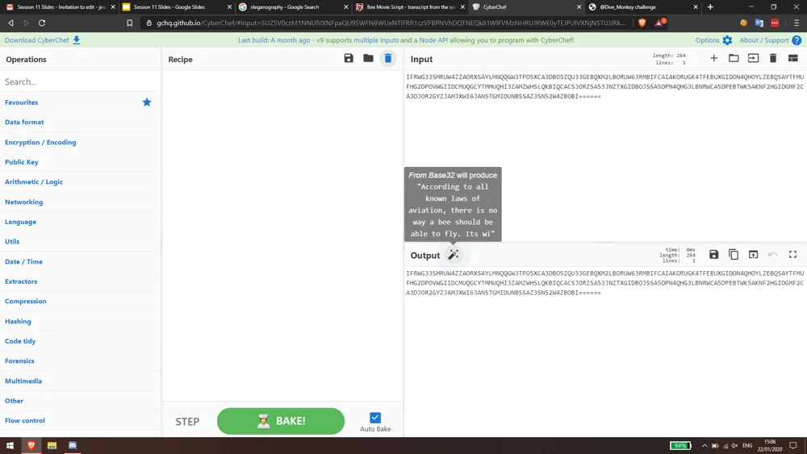
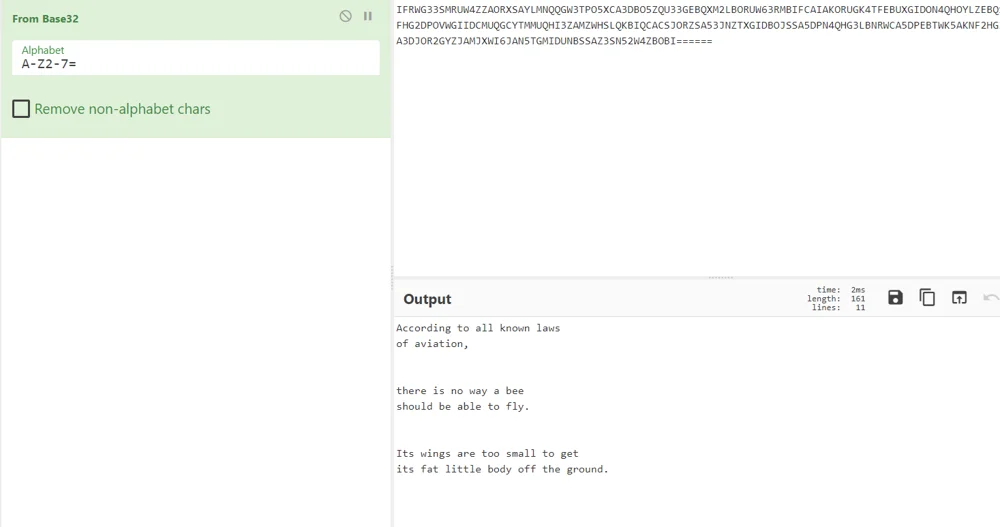
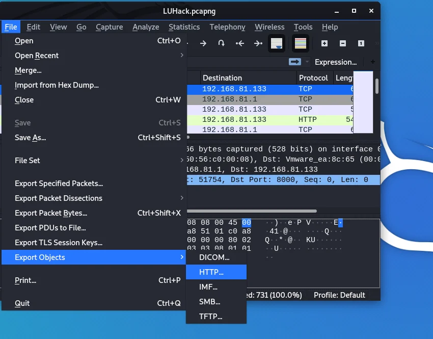
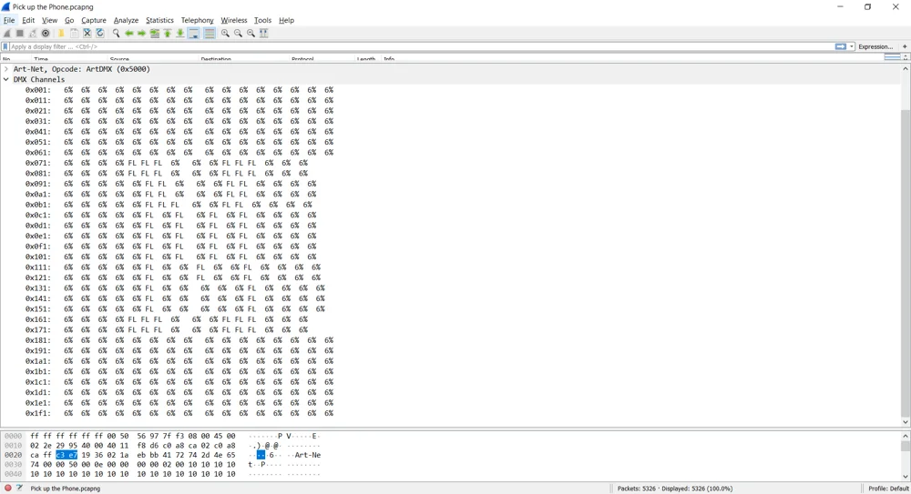
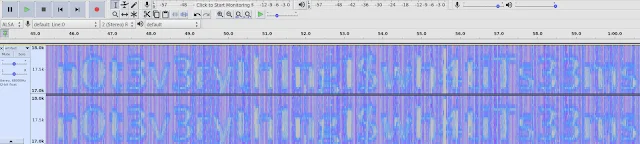
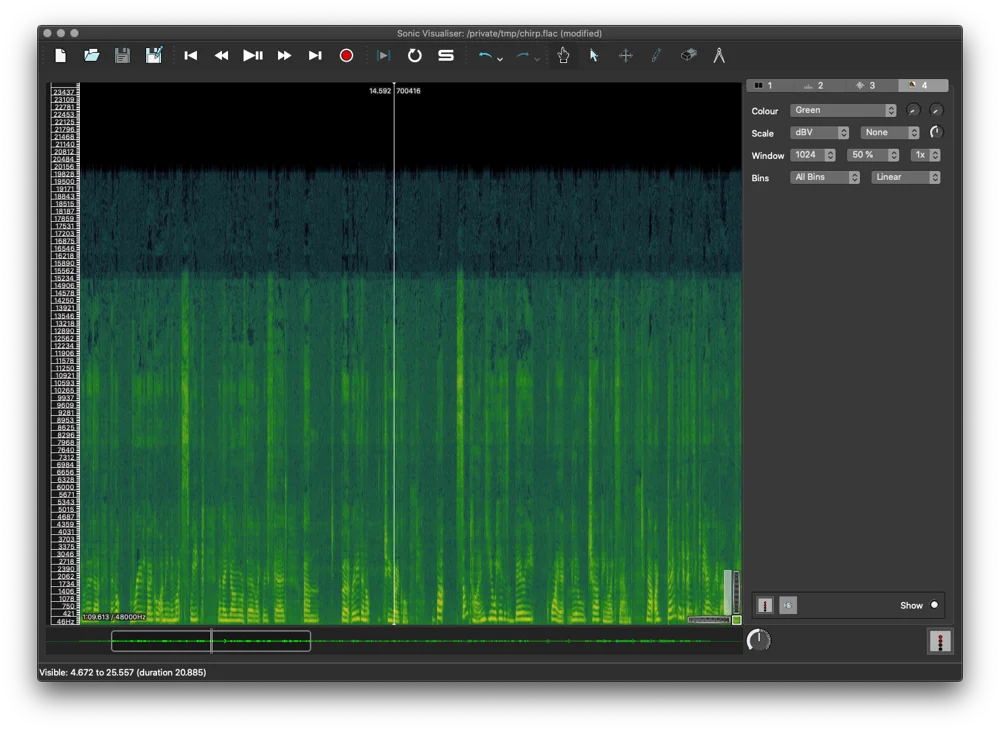
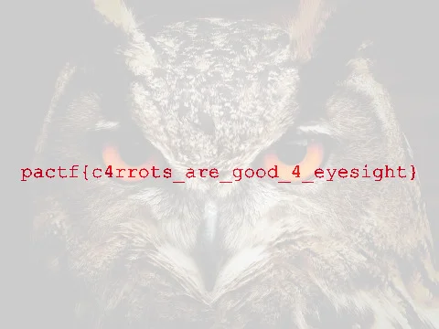
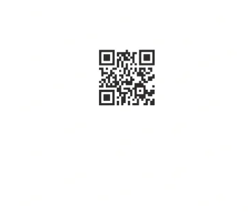
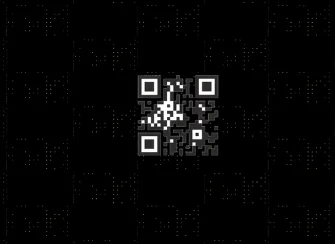
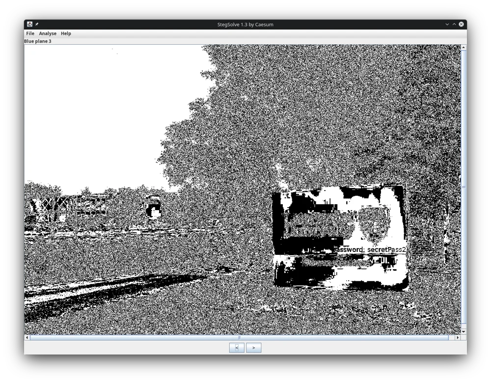

# Steganography

---

# Steg vs Crypto

* Greek origin:  _steganos_  meaning “covered” and  _graphein_  meaning “writing”\.
* Hiding the existence of the message\.
* Historic Examples:
  * 499 BC: Histiaeus shaved the head of his messenger\, wrote a message on his scalp and then waited for his hair to grow back\.
  * Chinese wrote messages on silk cloths\, scrunched them into a small ball and then covered them in wax and swallowed it\.
  * 16th Century: Hard boil an egg\, use a mixture of alum and vinegar to write on the shell\, peel the shell to see the message\.
  * Invisible ink
  * Microdots

"The Code Book: The Secret History of Codes and Code\-Breaking"\, Simon Singh\, pg5\-6


---


**Stenography** *hides* data so that it cannot be seen unless you know where to look

**Cryptography** *scrambles* the data \(so we cannot read it in its current form\, unless we know how to decrypt it\)


---

# How can this be used?

- Communicating with other people covertly
- Storing information you do nto want other people to find
- Malware uses it to hide it's data on a system that has been compromised see [this](https://www.bleepingcomputer.com/news/security/worok-hackers-hide-new-malware-in-pngs-using-steganography/), [this](https://www.bleepingcomputer.com/news/security/hackers-hide-malware-in-james-webb-telescope-images/) and [this](https://www.bleepingcomputer.com/news/security/github-hosted-malware-calculates-cobalt-strike-payload-from-imgur-pic/).

---

# Common Mediums

- Network packets
- Audio
- Images
- General file stuff

---


# Tools

Handy tool for automating a lot of this, also has a handy cheatsheet: [aperisolve.com](https://www.aperisolve.com/)

---

## General Files

* Embedding files in other files
* Encoded data
* Modified file extension

---


### file

Identifies file type by magic numbers \(special numbers at the start and end of files\)

\(Windows only actually uses extensions to decide what icon to show you for a file\)

``` bash
$ file hackerman.jpg
 JPEG image data, JFIF standard 1.01, aspect ratio, density 1x1, segment length 16, baseline, precision 8, 960x540, components 3
```

---


### strings

Used to see any printable strings in files

Use \-N \(N is a number\) flag to only include strings over a certain length

``` bash
$ strings -10 Plans. jpg
///33//@@@@@@@@@@@@@
0+.''' .+550055@@7@GGGEECECECE
2: Vn. $RO!B@X2
rLXnO~uHg*T
zS7jh_{3&!
inI"L(OK'b4
2x” (L¥exY3:
(CDRYFLD8,
https://www.youtube.com/watch?v=jc1Nfx4c5LQ
```

---


### binwalk

Used to extract files embedded inside of other files

Use with `-e` to extract files\, without to just look for them

```bash
$ binwalk -e trailer.jpg
DECIMAL     HEXADECIMAL     DESCRIPTION
-----------------------------------------------------------------------------
0           0x0             JPEG image data, JFIF standard 1.01
30          Ox1E            TIFF image data, big-endian, offset of first image directory: 8
16915       0x4213          PNG image, 960 x 640, 8-bit/color RGB, non-interlaced
17042       0x4292          Zlib compressed data, compressed
```

---


### cyberchef

Mass decryption tool

Sometimes able to self\-identify the cipher type \(“magic”\)






---

## Networks

Data may be  _covertly_  hidden in packet fields

---

### Wireshark

Used to analyse packet captures between devices\. Traffic can contain “interesting” data

Can export HTTP objects \(those transferred between sender and receiver\)

Can examine individual fields of packets

Some credentials may be included




---


This shows the programs attempt at interpreting data packets\, and below is the hex dump pane\.




---

## Audio Spectrograms

Audacity and Sonic Visualiser

---


### Audacity

Data can be hidden in spectrograms in audio files



[Blog that talk about this more...](https://blog.welcomethrill.house/2018/04/the-audacity-of-some-ctfs.html)


---


### Sonic Visualiser



Allows you to view the spectrogram\, IMO easier to use than audacity

---

## Images

Images have lots of data, and often you can use quirks of various formats of string image data to hide data without anyone noticing.

* LSB (Least significant bit) of pixels
* DCT (Discrete Cosine Transformation) coefficients of jpeg images
* Bit planes

---

### exiftool

View metadata about files\, such as creation and edit times

Some software\, such as Affinity Photo\, usually edits the metadata when you use it

```bash
$ exiftool pic.jpg
ExifTool Version Number         : 12.57
File Name                       : MAX_0005.jpg
Directory                       : .
File Size                       : 234 kB
File Modification Date/Time     : 2023:08:04 22:59:40+01:00
File Access Date/Time           : 2024:01:18 10:32:32+00:00
File Inode Change Date/Time     : 2023:08:05 15:07:17+01:00
File Permissions                : -rwxr--r--
File Type                       : JPEG
File Type Extension             : jpg
MIME Type                       : image/jpeg
JFIF Version                    : 1.01
Exif Byte Order                 : Big-endian (Motorola, MM)
Make                            : NIKON CORPORATION
Camera Model Name               : NIKON D600
Orientation                     : Horizontal (normal)
X Resolution                    : 300
Y Resolution                    : 300
Resolution Unit                 : inches
Software                        : Ver.1.03
Modify Date                     : 2023:07:25 15:59:13
Artist                          : Max Friedrich
Copyright                       : Max Friedrich
Exposure Time                   : 1/2000
F Number                        : 11.0
Exposure Program                : Program AE
ISO                             : 800
Date/Time Original              : 2023:05:13 14:57:24
Exposure Compensation           : -1
Max Aperture Value              : 1.7
Metering Mode                   : Multi-segment
Light Source                    : Unknown
Flash                           : Off, Did not fire
Focal Length                    : 85.0 mm
User Comment                    : 
Sub Sec Time Original           : 3
Color Space                     : sRGB
Exif Image Width                : 6034
Exif Image Height               : 4028
Sensing Method                  : One-chip color area
File Source                     : Digital Camera
Scene Type                      : Directly photographed
Exposure Mode                   : Auto
White Balance                   : Auto
Digital Zoom Ratio              : 1
Focal Length In 35mm Format     : 85 mm
Scene Capture Type              : Standard
Gain Control                    : Low gain up
Contrast                        : Normal
Saturation                      : Normal
Sharpness                       : Normal
Subject Distance Range          : Unknown
Serial Number                   : 6009059
Lens Model                      : 85mm f/1.8
GPS Version ID                  : 2.3.0.0
XMP Toolkit                     : XMP Core 5.5.0
Flash Compensation              : 0
Lens                            : 85mm f/1.8
Sensitivity Type                : Recommended Exposure Index
Photographic Sensitivity        : 800
Create Date                     : 2023:05:13 14:57:24
Creator Tool                    : Ver.1.03
Metadata Date                   : 2023:07:25 15:59:13+01:00
Color Mode                      : RGB
ICC Profile Name                : sRGB IEC61966-2.1
Creator                         : Max Friedrich
Rights                          : Max Friedrich
Title                           : MAX_0005
History Action                  : produced
History Software Agent          : Affinity Photo 1.10.6
History When                    : 2023:07:25 15:59:13+01:00
Current IPTC Digest             : e1ae56ba91aa0e0a7b4d7dd4d3614df6
Coded Character Set             : UTF8
Application Record Version      : 4
Object Name                     : MAX_0005
By-line                         : Max Friedrich
Copyright Notice                : Max Friedrich
IPTC Digest                     : e1ae56ba91aa0e0a7b4d7dd4d3614df6
Profile CMM Type                : Little CMS
Profile Version                 : 4.3.0
Profile Class                   : Display Device Profile
Color Space Data                : RGB
Profile Connection Space        : XYZ
Profile Date Time               : 2023:07:25 14:57:52
Profile File Signature          : acsp
Primary Platform                : Microsoft Corporation
CMM Flags                       : Not Embedded, Independent
Device Manufacturer             : 
Device Model                    : 
Device Attributes               : Reflective, Glossy, Positive, Color
Rendering Intent                : Perceptual
Connection Space Illuminant     : 0.9642 1 0.82491
Profile Creator                 : Little CMS
Profile ID                      : 0
Profile Description             : sRGB IEC61966-2.1
Profile Copyright               : No copyright, use freely
Media White Point               : 0.9642 1 0.82491
Chromatic Adaptation            : 1.04788 0.02292 -0.05022 0.02959 0.99048 -0.01707 -0.00925 0.01508 0.75168
Red Matrix Column               : 0.43604 0.22249 0.01392
Blue Matrix Column              : 0.14305 0.06061 0.71391
Green Matrix Column             : 0.38512 0.7169 0.09706
Red Tone Reproduction Curve     : (Binary data 32 bytes, use -b option to extract)
Green Tone Reproduction Curve   : (Binary data 32 bytes, use -b option to extract)
Blue Tone Reproduction Curve    : (Binary data 32 bytes, use -b option to extract)
Chromaticity Channels           : 3
Chromaticity Colorant           : Unknown
Chromaticity Channel 1          : 0.64 0.33
Chromaticity Channel 2          : 0.3 0.60001
Chromaticity Channel 3          : 0.14999 0.06
Image Width                     : 6034
Image Height                    : 4028
Encoding Process                : Baseline DCT, Huffman coding
Bits Per Sample                 : 8
Color Components                : 3
Y Cb Cr Sub Sampling            : YCbCr4:2:0 (2 2)
Aperture                        : 11.0
Image Size                      : 6034x4028
Megapixels                      : 24.3
Scale Factor To 35 mm Equivalent: 1.0
Shutter Speed                   : 1/2000
Date/Time Original              : 2023:05:13 14:57:24.3
Circle Of Confusion             : 0.030 mm
Field Of View                   : 23.9 deg
Focal Length                    : 85.0 mm (35 mm equivalent: 85.0 mm)
Hyperfocal Distance             : 21.86 m
Light Value                     : 14.9
Lens ID                         : 85mm f/1.8
```


---


### zsteg

Looks for hidden strings in png and bmp images\, such as those hidden in the LSB of image pixels \(really useful tool\)\. Use the ‘\-a’ flag to make it try harder\.

``` bash
$ zsteg Matrix.png
        "uggcf://fpp-yhunpx.ynapf.np.hx/Puevfgznf2019/zhs9gBP6fAFs4KceoSbT.svyr\nZip Password is Neo's full real name plus the year he appeared"
        "PQTQGA'b"
        "#7 &r@7DD"
        "2%UTCC>1P"
        file: 0421 Alliant compact executable common library not stripped
        "2/22/U_T042>?"
```


---


### steghide

Used to embed \(and extract\) files from images


```bash
$ steghide extract -sf hackerman. jpg
Enter passphrase:
wrote extracted data to "hackerman.txt".
```

---


### stegcracker

Used to bruteforce steghide with a wordlist


``` bash
$ stegcracker hackerman.jpg a.txt
StegCracker - (https: //github.com/Paradoxis/StegCracker
Copyright (c) 2019 - Luke Paris (Paradoxis)

Counting lines in wordlist...
Attacking file ‘hackerman. jpg’ with wordlist ‘a.txt'.
Successfully cracked file with password: almost
Tried 1529 passwords
Your file has been written to: hackerman. jpg.out
almost
```

---


### Image Comparisons

Images can seem identical to humans\, but may contain tiny differences in some pixels to reveal a message

Easy to do with imagemagick:

```bash
compare <image1> <image2> -compose src diff.png
```

---



[website that does something similar](https://www.imgonline.com.ua/eng/difference-between-two-images.php)


---


Some can also contain tiny patterns in slightly different colours to the background \(Someone scan QR code pls\)



---




---


### Stegsolve

Java interface for inspecting bit planes of images\. Very useful for detecting image\-in\-image steganography\.




---

# Email Demo

We will use GPG asymmetric encryption cos security and `steghide` to disguise what we are doing.

---

## Sending

1. Create key pairs and share your public key
    `gpg --full-generate-key`
2. Pick a photo and write your message in a text document
3. Import the other person's public key
    `gpg --import <publickey.gpg>`
4. Encrypt your message with the other person's public key
    `gpg -e -u <your private key> -r <recipient public key> <your file>`
5. Use steghide, you can use an empty password becuase you just encrypted it properly
    `steghide embed -cf <your image> -ef <your file>.gpg -p ""`
6. Send the message via email with the message as an attachment


## Receiving

1. Download the attachment
2. Use steghide to retrieve the encrypted message
    `steghide extract -sf <your image> -p ""`
3. Decrypt the file
    `gpg -d <your file>.gpg`
4. Read it

---


# Try the demo yourself

Why not try the demo for yourself with a friend? If you need help, check the instructions above, or ask me.

# Challenges

Challenges:  _[https://scc\-luhack\.lancs\.ac\.uk/challenges/tag/steg](https://scc-luhack.lancs.ac.uk/challenges/tag/steg)_

Submit flags on the website\, or in discord with /challenge claim


