<style>
img{
    height:70vh;
}

p.slide-index-18:nth-child(75) > img:nth-child(1){
height:20vh !important;}

p.slide-index-19:nth-child(75) > img:nth-child(1){
height:20vh !important;}
</style>

# Enumeration


---

# What is enumeration?

Enumeration is gathering context specific information about a system and its users\, and putting any existing information you have into context.

This gathered information is then used to assist with and enable exploitation of vulnerabilities in a system\.

---

# What are we looking for?

- Users
- Groups
- Web pages
- SMB shares
- Subdomains

---

# User Enumeration

Number of ways to enumerate users:

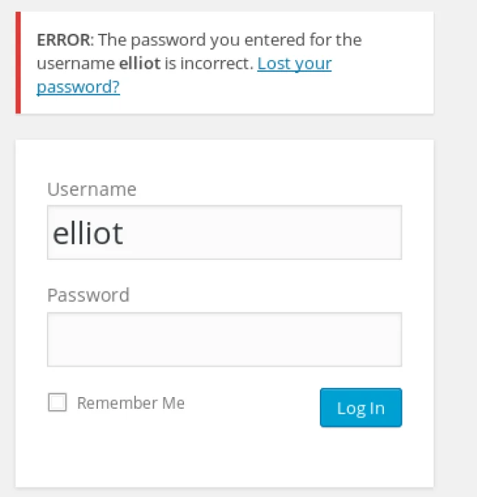
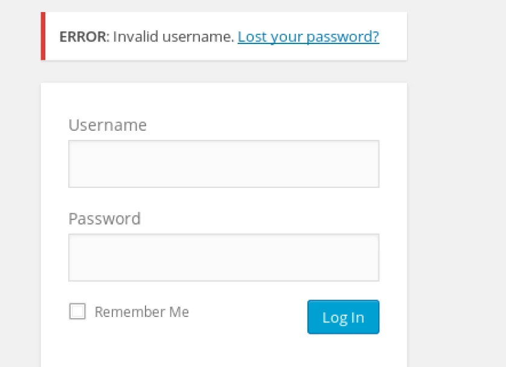

Some websites will give a different response when trying to log in with a user that doesn’t exist, and an incorrect password for a user that does exist.

---

Another way to enumerate users:

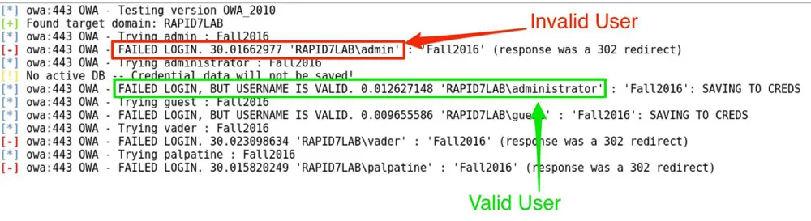

Many tools exist to discover valid users

---

# Enum4linux

Enum4linux is a tool that packages a lot of enumeration tools together into one easy interface\.

Wrapper around the tools smbclient\, rpcclient\, net and nmblookup

It can: 

- List Users 
- List group memberships 
- Workgroup and domain enum 
- OS Detection

_[https://labs\.portcullis\.co\.uk/tools/enum4linux/](https://labs.portcullis.co.uk/tools/enum4linux/)_

---

# Enum4Linux

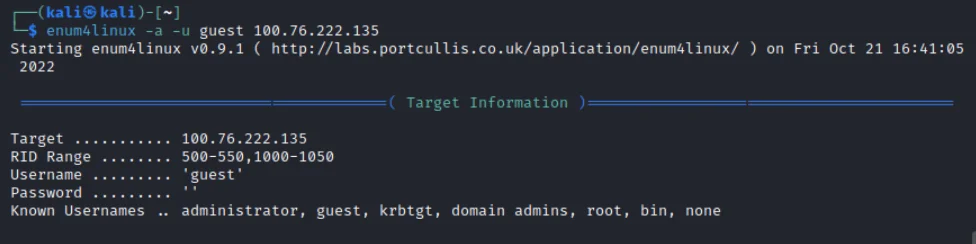

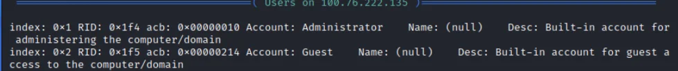

---

# SMBMap

Can be used to enumerate and retrieve SMB shares

Enumerate with `smbmap -H <ip> -u <user> [-p <pass>] -R`

Download with `smbmap -H <ip> -u <user> [-p <pass>] --download ‘.\\Folder\\File’`

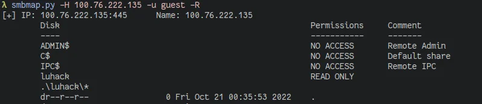

---

# Website enumeration


<div>
<div style="display: grid; grid-columns: auto auto">
<div style="grid-column: 1/2">
The `dirb` command of kali can be used to try many common sub\-pages of websites\.
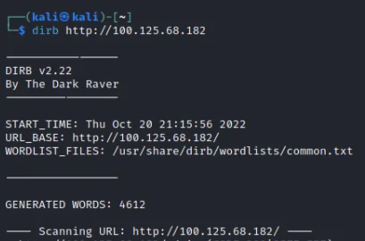 
</div>
<div style="grid-column: 2/3">
<div style="display: flex; justify-content: center;padding:3em">
<br>
</div>
<i>Be aware that this isn't particularly stealthy and you're also tapping in the dark </i>
</div>
</div>
</div>

---

Sometimes website authors think that adding a directory to the robots\.txt file
\(intended to instruct good\-faith bots what not to scan\) prevents malicious people accessing their private pages\.

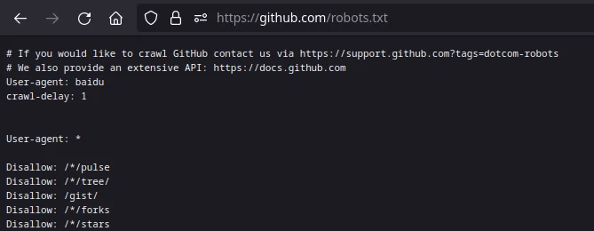

---

# Enumerating Subdomains

Discovering subdomains can reveal a great amount of information about a target\.
Many websites and other http services are hosted behind reverse proxies which use the Host header to select which back\-end to proxy to\.
There are a couple of ways to discover subdomains\, such as examining TLS certificates\, querying DNS servers\, brute forcing\. Lots of tools to automate this\.

As an example we will use lancaster\.ac\.uk

---

# Findomain, sublist3r, etc

Brute force approach\, queries many different APIs for subdomains\, optionally resolves the IPs these domains point to\.

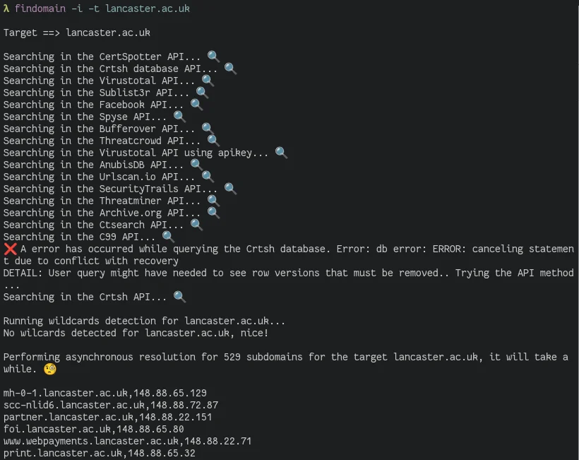

---

# Subdomains from Certs

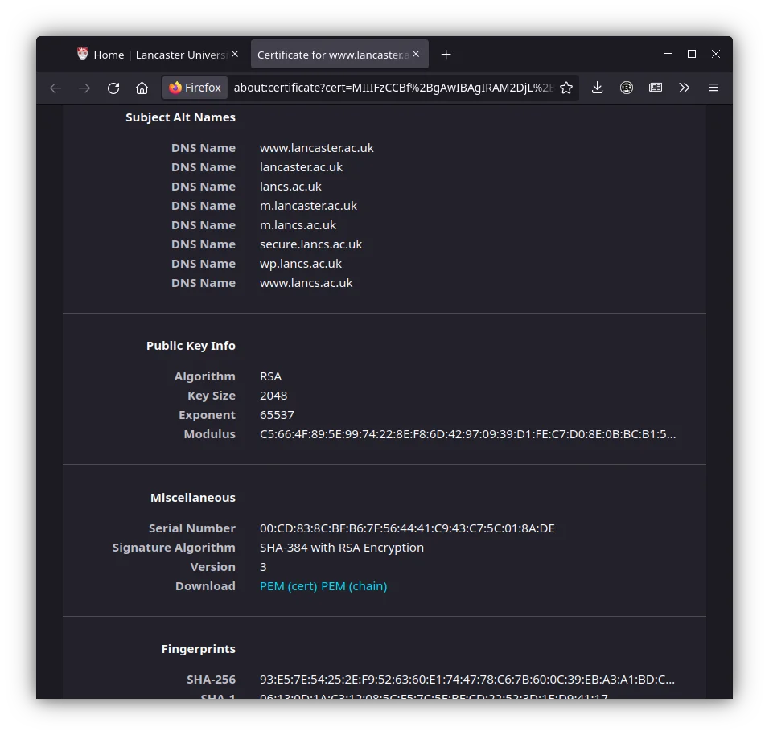

---

- Subject Alt Name \(SAN\) in Certs
- Certificate Transparency \(CT\) Logs
  - Certs added to log when issued\, can view all certs issued to a domain
  - Maintained by Google\, Cloudflare\, Digicert etc\.
  - Check:  
      - _[https://transparencyreport\.google\.com/https/certificates](https://transparencyreport.google.com/https/certificates)_
      - _[https://blog\.cloudflare\.com/introducing\-certificate\-transparency\-and\-nimbus/](https://blog.cloudflare.com/introducing-certificate-transparency-and-nimbus/)_
      - _[https://crt\.sh/](https://crt.sh/)_

---

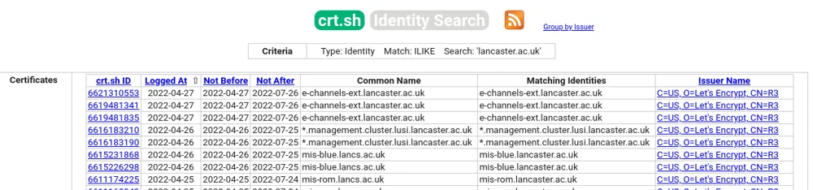

---

# DNS

“Normal” DNS query:

`dig @server <query type (A|AAAA|MX|TXT|CNAME|...)> domain`

Zone Transfer

Transfer an entire zone file, can reveal ALL records 😎

`dig @server axfr domain.com`

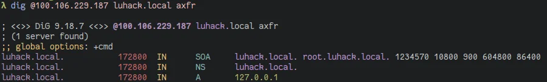


---

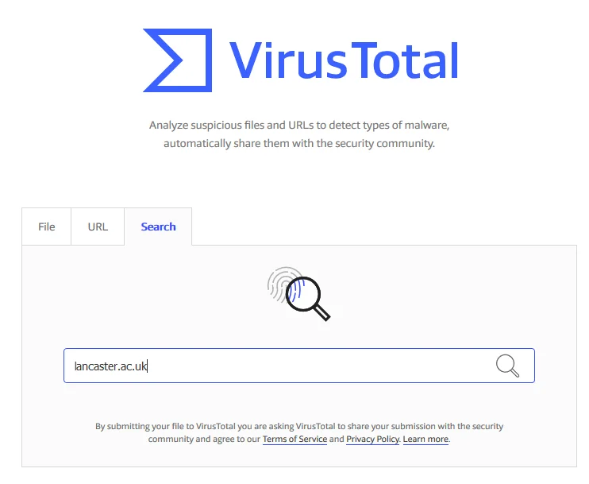

We can also just use online services\, such as virustotal

---

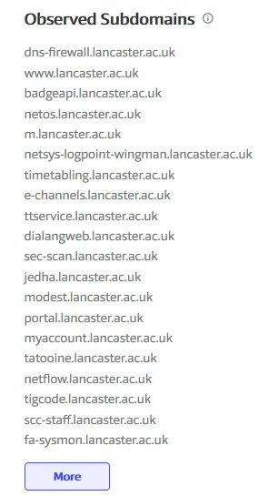

Wow\, look at all this\. There has to besomething interesting in here\.

wait\.\.\.

---

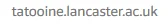


---

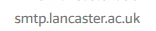

That was easy
Now\, what can we do with an SMTP server?
Let’s have a look
<span style="color:#666666">\(Don’t actually try to enum the lancs smtp server\, you’ll have ISS \*and\* GCHQ knocking on your door\)</span>

---

# SMTP Enumeration

SMTP \(Simple Mail Transport Protocol\) is a service used to send emails\.
It’s a simple text command based protocol\.
We can use the default commands for SMTP to enumerate users on the SMTP server\.
VRFY = Verify \- if valid user given\, returns code 250\,251\,252\. Will return 550 if no user found\. Might always return 252 for users not definitely on the machine \(\<user>@localhost\)

---

`smtp-user-enum -M VRFY -U <list of usernames> -t \<IP>`

`smtp-user-enum -M RCPT -D <domain> -U <list of usernames> -t <IP>`

\*Lots\* of wordlists on Kali in `/usr/share/wordlists`

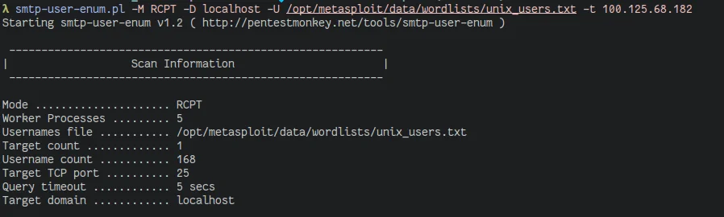

---

# FTP Enumeration

FTP is used to transfer files from a server to other computers
Some servers have anonymous login enabled

```
Username: anonymous
Password: \<anything/blank>
```

Can also brute force credentials using Hydra:

`hydra -L <user list> -P <pass list> -vV <IP> ftp`

`/usr/share/wordlists/rockyou.txt` is a huge pw list

---

# Quick sidenote

A  __huge__  amount of products are shipped with insecure default settings and credentials\.
It may seem obvious to change these\, but companies developing IoT devices just don’t care to allow the end user to change them\.
Often possible to bypass fancy hacking by just investigating default settings and credentials for a target device\.
The mirai botnet compromised millions of devices with a wordlist of only 60 users and passwords:  _[https://github\.com/danielmiessler/SecLists/blob/master/Passwords/Malware/mirai\-botnet\.txt](https://github.com/danielmiessler/SecLists/blob/master/Passwords/Malware/mirai-botnet.txt)_

---

# Useful Links

_[https://www\.virustotal\.com/\#/home/upload](https://www.virustotal.com/#/home/upload)_
_[https://searchnetworking\.techtarget\.com/definition/SNMP](https://searchnetworking.techtarget.com/definition/SNMP)_
_[https://www\.geeksforgeeks\.org/simple\-mail\-transfer\-protocol\-smtp/](https://www.geeksforgeeks.org/simple-mail-transfer-protocol-smtp/)_
_[https://censys\.io/](https://censys.io/)_
_[https://www\.shodan\.io/](https://www.shodan.io/)_
_[https://cirt\.net/passwords](https://cirt.net/passwords)_
_[https://tools\.kali\.org/password\-attacks/hydra](https://tools.kali.org/password-attacks/hydra)_
_[https://haveibeenpwned\.com/](https://haveibeenpwned.com/)_

---

# Lets start hacking

CTF style challenges on:  _[https://scc\-luhack\.lancs\.ac\.uk/challenges/tag/enum](https://scc-luhack.lancs.ac.uk/challenges/tag/enum)_
Machines:  \(check \#session\-resources for join links\, \#lab\-instructions for guide\)

luhack-enum-0: `100.96.62.36`

win-enum-0: `100.67.12.43`

Something I forgot to mention last week: If you’re using our VM service you already have access to all the lab machines inside the VM\, and don’t need to join them\.


