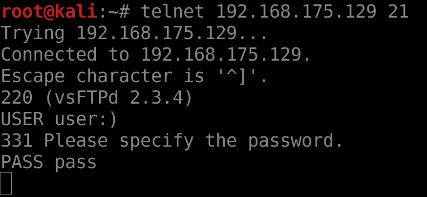

# Infrastructure

---

# What do we mean by “Infrastructure”?

---

Everything running on a target system

This includes:

- Remote access (SSH/ FTP/ SMB)
- Databases
- Web servers
- Other application services
- Sometimes even the operating system (MS17)

---

# Services

When we say services, we mean an application running in the Application layer

Every server is going to be running some exposed services.

Often people will not update these services, or misconfigure them

This is the basis of infrastructure attacks

---

# Common Vulnerabilities

- Path Traversal
- Buffer Overflow
- Command Injection
- SQL Injection
- Backdoors
- Remote Code Execution
- Arbitrary Command Execution
- Weak authentication (!)
- Misconfiguration (!)
- Many more..

---

# Spotting a potentially vulnerable service

Scenario: We have a target machine and we are in the final stages of recon. We are able to scan the machine to discover the services running.

Quick refresher - What does `-sV` specify??

---

# Let’s have a look at the results

---

# Wow

This is a lot of services

It is unrealistic that this many services would be running

This is an intentionally vulnerable VM (metasploitable)

Which services here look interesting?

---

# Spotting Vulnerable Services

Lets look at the first service on the list

An FTP server running on port 21.

We have the FTP server name and its version

How do we know if it is vulnerable?

---

# 

---

# Also..

---

# Google is all-powerful

This service is super vulnerable

A simple search reveals….

---

# Great, now what?

Let’s try logging in

---

# Let’s try the exploited login

This hangs, great, let’s look now at port 6200

---

# *hacker voice* we’re in

---

# Easy, but a pain

This was obviously an easy exploit that has since been patched

But, if we found this in the wild, it takes a while to manually do all those steps

It also requires you read how the exploit works

What if we want to have this process simplified?

---

# Metasploit

Metasploit is a tool that pools many exploits together into one place.

Makes exploiting services that are in the Metasploit database trivial

A very useful tool.

You will definitely use it, so let’s try that exploit again

This time, using Metasploit

---

# A short cheatsheet for working with metasploit

* The msfconsole.
  * Looks like:  or 
  * Search for your module/exploit with  `search <rough term>`
  * Load module with `use module/path/thing` or `use <number in list>`
  * List options with `options`, set module options with `set <option> <value>`
  * Initiate exploit with `run`
  * List sessions with `sessions`, interact with a session with `sessions -i <num>`, upgrade a reverse shell session to a meterpreter session with `sessions -u <num>`
* Meterpreter
  * A remote shell with many useful features, looks like: 
  * Can be used for  **uploading** files,  **downloading** files,  **editing** files, run any shell command on the victim, attempt to privesc, etc.
  * Use `background` to return to msfconsole.

---

# Firing up

---

# Finding our exploit

We can use `use 0` here as a shortcut.

---

# Setting options

---

# Setting payloads

This exploit only supports basic unix shells, but others can use meterpreter

---

# Let’s throw this at our target

---

# Great! Much easier

Metasploit is extremely useful and also easy to get to grips with

If you ever want to see the options an exploit may need, simply type “options”

There are a few terms you may come across when exploring this topic area.

We will quickly run through some of these

---

# Payload?

A payload is a piece of code to be executed when an exploit runs

Many different types of payload, but they are normally categorized as:

- Staged
- Non-staged

---

# Staged

Staged payloads attempt to set up a connection between an attacker and their target

The most common form of staged payload is a Reverse Shell: an attacker opens a port on their system, and through some means causes the victim machine to create a shell and pipe it’s input and output through to the attacker.

Most Metasploit exploits default to using a Reverse Shell, but this can be changed

---

# Shells

There are two main ways of popping shells:

- Bind
- Reverse

---

# Reverse shells

Reverse shells operate by opening a listening port on *your* machine.

A payload is then sent to the target which instructs it to connect back to *your* machine and execute any further commands.

Reverse shells only work when your machine has an IP address which is reachable directly from the target machine. So reverse shells won’t work from behind a NAT, etc.

However reverse shells bypass any reverse proxying that might be going on in the server which would prevent bind shells.

---

# Bind shells

In opposition to reverse shells, bind shells open a port on the *target* machine which provides whoever connects to it with a shell on the target.

Bind shells work when your computer is behind a NAT or firewall, but might not work if the service you are exploiting is running inside a container.

The opened bind port will be visible by everyone using the machine, for the windows boxes which are shared, you should choose a random port using `set LPORT <port>`

---

# Using a bind shell

Say we load up the eternal blue exploit on metasploit.

By default it will use a reverse_tcp  meterpreter shell as the default payload.

---

To set the payload, type `set payload `  and press tab, metasploit will start to complete the possible payloads.

Select a bind shell by completing the path, for example: `set payload windows/x64/meterpreter/bind_tcp`

---

# Using a bind shell (options)

If we run the `options` command, we will see parameters for the payload.

The important options here are `LPORT` which is the port the payload will open up on the target machine.

`RHOST` should default to the `RHOSTS` option of the exploit parameters.

---

# Non-Staged

Non-staged payloads are exploits with everything you need rolled into one

The attacker does not get connection to this payload

These payloads are usually more stable, as you don’t need to rely on a connection

They are limited however, as they can normally only be large enough to complete very specific tasks

---

# Meterpreter

Meterpreter is a special, super payload

Very hard for a victim to trace as it resides entirely in memory, never writing to disk

Meterpreter shells are extremely powerful

Allow for loading of scripts, downloading of files etc.

Lots of fun features

---

# Useful Links

_[https://www.offensive-security.com/metasploit-unleashed/meterpreter-basics/](https://www.offensive-security.com/metasploit-unleashed/meterpreter-basics/)_

_[https://metasploit.help.rapid7.com/docs/metasploit-basics](https://metasploit.help.rapid7.com/docs/metasploit-basics)_

_[https://www.exploit-db.com/](https://www.exploit-db.com/)_

_[https://cve.mitre.org/](https://cve.mitre.org/)_

_[https://metasploit.help.rapid7.com/docs/metasploitable-2](https://metasploit.help.rapid7.com/docs/metasploitable-2)_

_[https://jonathansblog.co.uk/metasploit-tutorial-for-beginners](https://jonathansblog.co.uk/metasploit-tutorial-for-beginners)_

---

# Practical

Challenges:  _[https://scc-luhack.lancs.ac.uk/challenges/tag/infra](https://scc-luhack.lancs.ac.uk/challenges/tag/infra)_

Machines:  (check #session-resources for join links, #lab-instructions for guide)

Luhack-infra-0: 100.105.98.107

win-infra-<0.8>: 100.109.213.117, 100.78.86.152

Submit flags on the website, or to the bot (LUHack-Verification-Bot)

