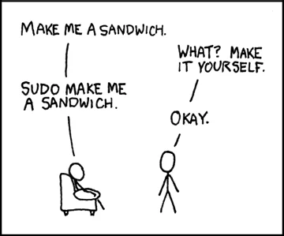

# Privilege Escalation

## (on Linux)


---


# What is privesc?

Often when exploiting infrastructure you will gain access to low privilege users

You might have access to the system, but can’t read/do anything useful!

This means we need to access a user with more privileges

Ideally we’d like access to the root (admin) user, but sometimes we don’t need to go that far


---


# How do we escalate privileges?

_There is no one way to escalate privileges._

This involves getting creative and taking a good look at the system to spot potential paths to other accounts.

This might require some linux knowledge


---


# Some common vectors...


---


# SUID

A quick rundown on linux permissions


---


Allows users to run an executable with the permissions of its owner


---


# SGID

The same as SUID, but uses the permissions of the group owner


---


# Misconfigured sudo

Do we have permission to run anything as root?




---


# World-writable scripts invoked by root

Going back to permissions…

Are these scripts being run at regular intervals?

Can we edit what root is running?


---


# Misconfigured path

When calling commands without their absolute path, bash will use your PATH to determine which script to run

```bash
> echo $PATH 
/usr/local/sbin:/usr/local/bin:/usr/sbin:/usr/bin:/sbin:/bin
> which echo
/usr/bin/echo
```

If scripts are calling executables without their absolute paths, you may be able to create your own executables in one of these directories to override it and run your own code


---


# Weak passwords

Are /etc/passwd or /etc/shadow readable?

Can we crack the root/user password?


---


# Misconfigured (internal) services

Going back to infrastructure..

Are there services running only internally that can be exploited to gain root access?

Do we need to pivot to another user to access/exploit these services?


---


# Kernel exploits

Very unlikely


---


# Tools

As usual, scripts have been written which automate a lot of this process for us

linPEAS.sh

_[https://github.com/carlospolop/PEASS-ng/tree/master/linPEAS](https://github.com/carlospolop/PEASS-ng/tree/master/linPEAS)_

LinEnum.sh _[https://github.com/rebootuser/LinEnum](https://github.com/rebootuser/LinEnum)_

lse.sh _[https://github.com/diego-treitos/linux-smart-enumeration](https://github.com/diego-treitos/linux-smart-enumeration)_

Many more…

The output of these scripts can get quite long, sometimes you may need to write to a file and read it back


---


# Practical lab

To access today’s lab:

IP: `100.121.76.160`

User: `anonymous`

SSH Port: 23

Try to escalate to the different root accounts.Use the scripts provided (or download others) and hunt around the system.


---


# OverTheWire

A series of many challenges designed to improve basic linux skills as well as security knowledge

Each challenge you complete gives you the password to the next challenge

_[https://overthewire.org/wargames/](https://overthewire.org/wargames/)_


---


# HackTheBox

By now you have (nearly) all the basics for attempting HackTheBox machines

To sign up you must first hack their login system (this is intended)

These boxes are very useful for gaining knowledge into infrastructure/webapp/privesc exploitation methods

_[http://hackthebox.eu](http://hackthebox.eu)_


