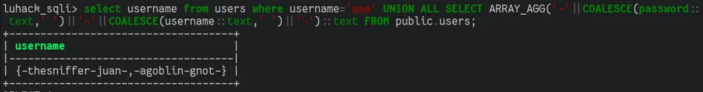
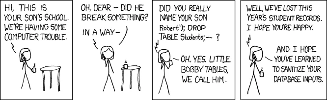

# Web Applications

# 

---

# Web Applications

Most companies have some kind of public facing web application

There are often vulnerabilities in these\, most commonly in web apps written in PHP\.

---

Vulnerabilities in the web app code - someone has coded a php page that doesn’t include basic security features so just allows for exploitation

---

# 

---

# Some common web vulns...

Susceptibility to brute force attacks (no rate-limiting)

Command Injection

Unrestricted file upload

Cross Site Scripting \(XSS\)

Server Side Template Injection \(SSTI\)

SQL Injection \(SQLi\)

Cross Site Request Forgery \(CSRF\)

__And More: https://owasp\.org/www\-project\-top\-ten/__

---

# Directory Traversal

Websites often have existing directories that are hidden to users

Using tools such as dirb allows to \(in most cases\) find these hidden directories

---

# Brute Force

---

Tools such as hydra can automate brute forcing web forms

---

# Command Injection

---

# File Upload

---

# SQL Injection

The most common web vulnerability is SQL injection \[1\]

SQL is used for database access on servers \- so most web applications have some form of database\. SQL based databases are the most common

SQL injection as a vulnerability was first discovered in 1998 \- but it’s still a common issue found today

It’s possible to manually exploit an SQL database but SQLmap helps automate this process

\[1\]   _[https://www\.owasp\.org/images/7/72/OWASP\_Top\_10\-2017\_%28en%29\.pdf\.pdf](https://www.owasp.org/images/7/72/OWASP_Top_10-2017_%28en%29.pdf.pdf)_

---

A misuse of a database interface that allows arbitrary sql to be executed\.

Allows an attacker to access the database\, probably view all the data\, and potentially gain arbitrary code execution depending on how the database is set up\.

---

# Database Table - Users

| UserID | Username |
| :-: | :-: |
| 1 | MysteryPotatoLAD |
| 2 | LAD |
| 3 | RicoFranco |

---

# Online form entry

---

# Regular SQL statements

SELECT  \*  FROM  Users  WHERE  UserID = 1

---

SELECT  \*  FROM  Users  WHERE  UserID = 1

This means we want to access records in the database

We specify \*\, meaning every column

---

SELECT  \*  FROM  Users  WHERE  UserID = 1

The table we want to access\.

This case it’s ‘Users’

---

SELECT  \*  FROM  Users  WHERE  UserID = 1

We are looking for UserID 1

---

# Returned result

| UserID | Username |
| :-: | :-: |
| 1 | MysteryPotatoLAD |

---

# SQL Injection: What causes it?

---

# Most basic SQL Injection

SELECT   *  FROM   Users  WHERE   UserID = 123 OR 1=1

---

# Returned result

| UserID | Username |
| :-: | :-: |
| 1 | MysteryPotatoLAD |
| 2 | LAD |
| 3 | RicoFranco |

---

# SQL Injection: How to fix it

---

# SQL Injection: Advanced exploiting

Not all sql injections are simple and let you view the result of arbitrary queries\.

Queries that return single named fields prevent us from completely controlling the tables that we select from the database\, so we have to be more advanced\.

Some ways to circumvent this issue are UNION queries\, and time based side channels\.

---

# Postgres UNION queries

Queries can be combined in postgres using UNION ALL\. UNION is special in that it ignores table names\, and just fills in output columns by the order they appear\, this allows us to again read arbitrary data from the database\.

---

# Time based side channels

Another to read arbitrary data is using side channels\, you can have the database conditionally sleep\, and then determine the value of that condition by measuring how long the application takes to respond\.

Takes a long time to completeas it has to binary search tofind each character of everycolumn\.

---

# SQL Injection: Automation

Determining how to exploit a sql injection\, and performing it is time consuming and tedious\, but fairly generic\, a perfect job for a script\.

The most well known tool for this is  _[SQLMap](http://sqlmap.org/)_

---

# Simple SQLMap usage

Sqlmap is simple to use\, just run \`sqlmap \-u \<url> \-\-forms\`\.

Pass \`\-\-tables\` to dump the list of tables:

Pass \`\-\-dump \-T \<table name>\` to dump thecontents of a table\.

---

# 

---

# Proxy Tools

Proxy tools such as Burp Suite or OWASP ZAP can be used to change the contents of HTTP requests\.

You can also just use the debugger tools of firefox \(edit and resend\)\, or just plain cURL commands \(Both FF and Chrome have an option in the network tab to copy requests as cURL commands\)

---

# Cross-Site Scripting (XSS)

Injecting client\-side scripts into web pages can allow an attacker to execute scripts remotely

Most forms are potentially vulnerable to XSS

3 types of XSS: Reflected\, Stored\, and DOM\-based

---

Alex, just mention that we’re not explaining about DOM-based XSS as it’s more complex and not what we’re doing today, but there’s need for awareness that it exists

---

# XSS

---

# Reflected XSS

Most basic XSS attack

Script is sent to clients via some part of the page URL

For example: https://bad\.site?title=\

Non\-persistent i\.e is not stored on the server

---

# Stored XSS

Can be more devastating than reflected XSS as it does not require a client to visit a malicious link\.

Script is stored server\-side and is run whenever it makes its way onto the page\.

---

# XSS example

---

---

# Source Code

Web page source code can sometimes contain useful information that is not displayed\.

---

# Server Side Template injection: What is it?

A misuse of templating engines that results in an attacker being able to run arbitrary code\.

Templating engines are commonly used to allow for HTML to be generated using data provided\, in a simple way\. For example: A Jinja2 template\.

---

# SSTI: What causes it

A website developer may want people to be able to use their own templates\, or insert dynamic content \(such as the date\) where they want\, templates render inside a limited environment so it may appear safe\, but if the language powering the templates is a heavily dynamic one such as python or javascript\, there may be plenty of ways to escape the limited environment and execute arbitrary code\.

---

# SSTI: How to fix it

The simplest way to fix SSTI is to only render templates that are under your control \(i\.e\. only static files\)\, most templating engines make it difficult to render arbitrary templates by mistake\.

---

# SSTI: How to exploit it.

For this example we’ll cover Jinja2 templates\.

---

In python\, it is possible to find all the subclasses of a parent class\. So if you can find a way to get hold of the ‘object’ base class\, you can then get hold of any other class loaded in the interpreter\.

---

That list is fairly long\, but there’s one useful class in there: subprocess\.Popen\, after some trial and error we can find the index of it:

---

Now that we have Popen\, we can use it:

We pass a list of the command and it’s parameters\, and \`stdout=\-1\` to make it capture the stdout of the program\, instead of just printing it to the stdout of the web server\, and use \.communicate\(\) to read the output\.

---

# Cross Site Request Forgery

CSRF is when a user loads a website that then makes a request to another website\, or when a user clicks on a link\, that results in an undesired action being performed on the other website\.

For example\,  _[https://superlogout\.com/](https://superlogout.com/)_  sends requests to log you out of quite a lot of websites\.

This happens because by default\, browsers send the cookies of a website on all requests to that site\, even if that site isn’t the ‘main page’ of a tab\.

---

# CSRF: Exploiting it

For example\, if your bank website was vulnerable to CSRF\, it would be possible to trick people into clicking a link that would send you money\.

---

# CSRF: Mitigation

Easy way: use localStorage + headers for auth

Hard way: Issue CSRF tokens for each request to mitigate CSRF attacks

But why would you do that?
Well, you can't set headers from html \<form\> elements, so the only way of getting auth working without JS is by using cookies (can be set server side)

---

# Helpful Resources

DirbSQLmapBurp SuiteJohnTheRipper

The F12 key

---

# Practical

Challenges:  _[https://scc\-luhack\.lancs\.ac\.uk/challenges/tag/web](https://scc-luhack.lancs.ac.uk/challenges/tag/web)_

Machines:  \(check \#session\-resources for join links\, \#lab\-instructions for guide\)

Luhack\-web\-0: 100\.127\.159\.170

Submit flags on the website\, or to the bot \(LUHack\-Verification\-Bot\)

