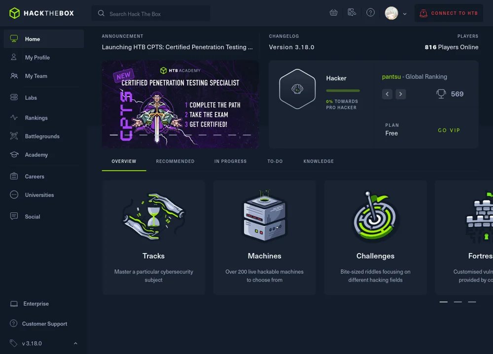
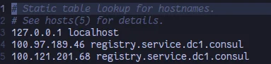

# 

---

---

# Getting connected

HTB has a complete onboarding experience\, it’s easier for you to just create an account and let the website show you what to do than have us explain\.

_[https://help\.hackthebox\.com/en/articles/5185687\-introduction\-to\-lab\-access](https://help.hackthebox.com/en/articles/5185687-introduction-to-lab-access)_

---

# 

---

# General HTB procedure

* Join a box to get access to it inside the HTB VPN\, the box’s IP will be shown on the website\.
* Start with recon\, use NMAP to find services
* HTB boxes commonly have a web server running\, \*usually\* this is just a template website and the index page itself won’t be very interesting \(don’t waste time trying to sqlmap contact forms\, etc\)
* It’s useful to add \`\<boxname>\.htb\` to your /etc/hosts file in kali\.
  * Plenty of times there’ll be a website only accessible via the \.htb domain
* After running NMAP\, fiddle around with exposed services\. Google version numbers\, etc\.

