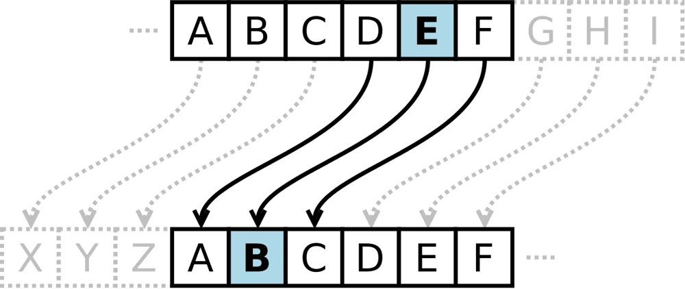
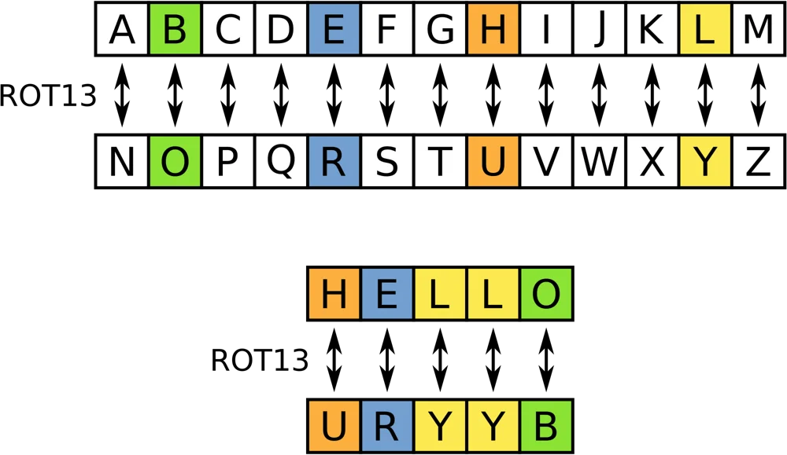
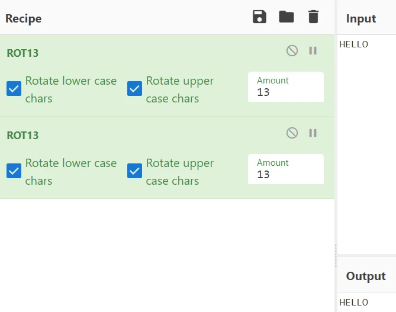
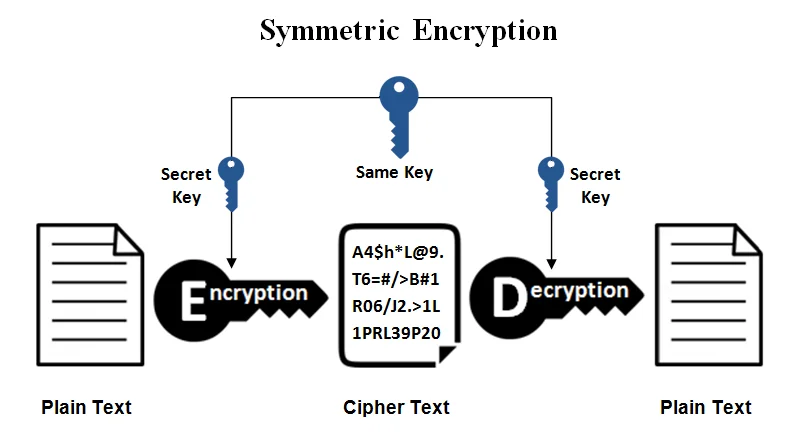
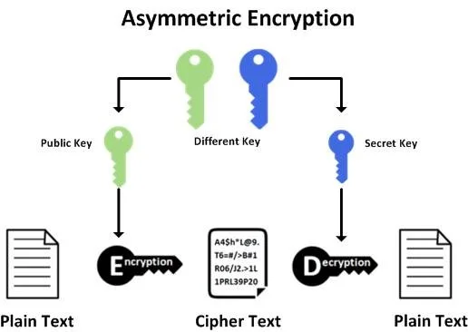
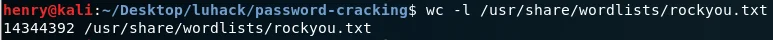
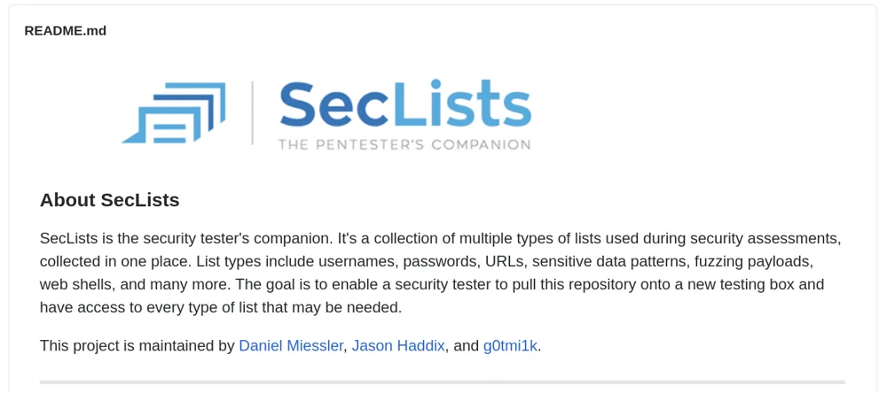
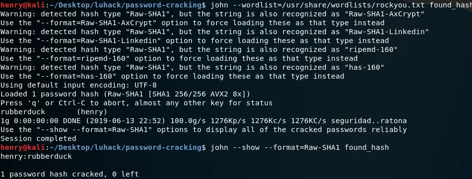

# Cryptography

## Ciphers, encryption and hashing


---


# What is cryptography?

Essentially converting a message (plaintext) into a form that cannot be read (ciphertext) without knowing the method or keys used to get from one form to the other.

Word is from Ancient Greek, meaning “secret writing”.

NOT hiding the existence of messages, that is Steganography (Invisible Ink, Micro Dots, embedding files in images, clandestine communication channels....)


---


# Kinds of Cryptography

Classical Ciphers (Caesar, ROT13)

Symmetric Ciphers (AES)

Asymmetric Ciphers (RSA)

Hashing (if the hash algorithm is cryptographic: md5, sha512)


---


# Classical Ciphers

Normally just some kind of rule of swapping the letters in the alphabet around.




---


# Classical Ciphers - Caesar Cipher

Simply rotates the alphabet round a set amount, I.e. A -> B, B -> C…

Very few keys - only 26! So easy to work out plaintext by bruteforce!


---


# Classical Ciphers - Caesar Example

__EBIIL, TLOIA!__

What is the plaintext?

__HELLO, WORLD!__

__Not very hard! Look out for distribution of letters (E,T, & A) are the most common, double letters help too!__


---


# Classical Ciphers - ROT13

Chops the alphabet in half, no key this time!




---


One warning, however: ROT13 + ROT13 = Plaintext again!




---


# Symmetric Encryption

Same key is used for both encryption and decryption

XOR, AES, DES, RC4




---


__You have to share your key with someone so that they can encrypt their message, and then you use the same key to decrypt it.__

`2f495e36...da70b969`


---


# Symmetric encryption: XOR

XOR is an incredibly simple cipher, take a plaintext and an encryption key, repeat the encryption key until it is as long as the plaintext, then combine each bit of the plaintext with the equivalent bit of the encryption key.

Decrypting XOR is as simple as encrypting the ciphertext with the same key again.

---

```
foo xor bar =

01100110 01101111 01101111

xor

01100010 01100001 01110010

=

00000100 00001110 00011101
```


---


# Asymmetric Encryption

Different keys are used for encryption(public) and decryption(private)

The encryption key (public key) can be known to anyone, hence public, meanwhile the decryption key should only be known to the owner of the keys




---


__Only you can decrypt the messages using your private key__

__Share the public key with others so that they can send you encrypted messages__

`2f495e36...da70b969`


---


__Decrypt the signature with the public key to get a hash__

__If the hash matches the hash of the message, alice used their key to encrypt the signature__

__Encrypt the signature of the message with your private key__

`21312asdakjshdaewwe`


---


# Hashing

A hashing function is a “one way” function

It maps an input to an output, but with no way of determining the input from an output because of “hard maths”

If two different inputs have the same output “hash”, then this is a collison

Cryptographic: MD5, SHA1, SHA256, Blowfish, BCrypt

Non cryptographic: SeaHash, MurMurHash, FNVhash


---


# Hashing: hard maths

Imagine a function which outputs a number when we give it different words

f(“hello”) = 5

f(“world”) = 5

f(“luhack”) = 6

Clearly this is a very bad hashing algorithm since it gives us a lot of information about the plaintext (the length)


---


What if we turned each letter into a number (a=1, b=2) and multiplied them all together?

f(“hello”) = 8 * 6 * 12 * 12 * 15 = 103680

f(“world”) = 23 * 15 * 18 * 12 * 4 = 298080

f(“luhack”) = 12 * 21 * 8 * 1 * 3 * 10 = 60480

This is a little better, since you can’t see tell much about the words from the hash immediately, but you could start to work it out…

You might also have lots of collisions


---


# Hashing

If we cannot “reverse a hash”, how do we find out the input from an output?

__We can use a brute-force approach, work out the hash values of lots of data we think it might be, and see if any match__

__John and hashcat do this on Kali, websites also available for this__

__(we’ll come back to this)__


---


dd4b112ffcadf9726879197ff24b88c0

What is the plaintext of this hash? \[Hint: MD5\]


---


# Encodings

Encodings are used to represent binary data as ASCII to make it readable

Lots of encodings available: Base\[2,10,32,58,64,85\]

“Binary” is Base 2, “Decimal” is Base 10, “Hexadecimal” is Base 16

Another very important skill in CTFs is recognising data that has been encoded


---


Plaintext: Hello World

Base 32: `JBSWY3DPEBLW64TMMQ======`

Base 64: `SGVsbG8gV29ybGQ=`

Base 85: `87cURD]i,"Ebo7`

Base 65536: `驈ꍬ啯ꍲᕤ`


---


# Password Cracking

Cracking passwords is done using John the Ripper, since we store the hash of a password, we need to hash some possible passwords, and see if any of these match with the hashes of the passwords. This is called a dictionary attack.

Kali provides some dictionaries of common passwords (wordlists, stored at /usr/share/wordlists/) - the most popular is called rockyou.txt

14,344,392 passwords!




---


You can also find many more wordlists online

_[https://github.com/danielmiessler/SecLists](https://github.com/danielmiessler/SecLists)_

Over 100Mb of password lists, default credentials and cracked hashes




---


Sometimes you want to crack more complicated passwords with combinations of letters, numbers, special characters…

The method is still brute force, but you have to generate your own dictionary

You can do this using “rules” which can take an existing wordlist and apply something to it, like adding every number between 1950 and 2010.

---

```
123456
12345
123456789
password
Iloveyou
abc123
1234561950
12345
123456789
password
Iloveyou
abc123
```

[https://charlesreid1.com/wiki/John_the_Ripper/Password_Generation](https://charlesreid1.com/wiki/John_the_Ripper/Password_Generation)_  _ _


---


John takes a file containing password hashes and a wordlist.

So, say we find a hash af682f2cbb6d73fd4e42a0f0913f83d7e14ff463, how do we crack it?

```
123456
123456789
qwerty
password
111111
12345678
abc123
1234567
password1
```

---

`twooter-leak.txt`

```
henry:af682f2cbb6d73fd4e42a0f0913f83d7e14ff463
cameron:5f4dcc3b5aa765d61d8327deb882cf9948ae5
alice:7c6a180b36896a0a8c02787eeafb0e4c28b38
bob:e10adc3949ba59abbe56e057f20f883ead422
```

---




The first command shows worldist hash matches. The second command shows the cracked passwords in the form `username:password`. 

---


`john --wordlist=<wordlist> <hash file>`

OR

`john --wordlist=<wordlist> --format=<format>* <hash file>`

*if format is known, usually either “Raw-SHA1” or “Raw-MD5”


---


We can use tools to convert some encrypted file types (.zip, .pdf, etc.) into a form that John can crack

Usually in the form of “[pdf, zip, …]2john”

`sudo zip2john <encrypted zip file> > ziphash`

`sudo john --wordlist=<wordlist> ziphash`


---


# Cryptanalysis

Cryptographic algorithms when implemented and used correctly are pretty difficult to break

Simpler cryptographic algorithms (such as XOR) while easy to implement are easily misused.

Algorithms such as AES and RSA can be difficult to mess up if used properly, but are still vulnerable to attacks.


---


# Key reuse vulnerabilities

The XOR cipher has one large problem: an attacker can trivially recover an encryption key if the key is used multiple times to encrypt different plaintexts, and the attacker can submit plaintexts to be encrypted:

XOR has the following rules:

`(a xor b) xor c = a xor (b xor c)`, `a xor a = 0`, `a xor 0 = a`

Therefore, given the plaintext: `m`, and ciphertext: `(k xor m)`

`(m xor k) xor m = (m xor m) xor k = 0 xor k = k`

---

# Context

We will be putting this into practice via a fictional scenario.

---

- Republic of Rheged (us) is in a state of cold war with the Kingdom of Deira (them)

- The CIA of Deira is called the Ministry Of InterNational Intelligence Gathering, or MOINIG


---

# luhack.uk/w1
