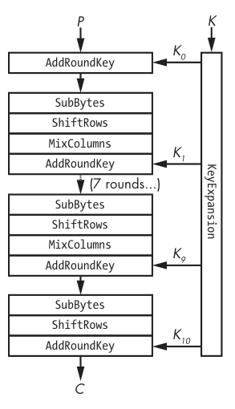
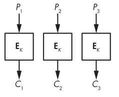
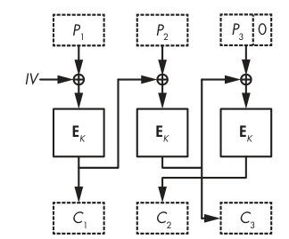
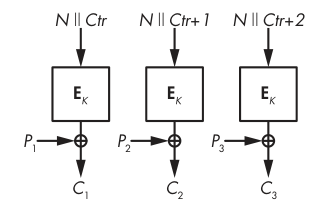

# Hacking Military Grade Encryption

---

## Terms of reference

- Plaintext: The original data
- Ciphertext: The encrypted data
- Key: The secret used to encrypt and decrypt the data
- Encryption: The process of converting plaintext to ciphertext
- Encoding: The process of changing the format of data, e.g. binary to hexadecimal

---

## A good cyphertext

- Looks like random data
- Has good confusion and diffusion

---

## Confusion

- The relationship between the key and the cyphertext should be complex
- Changing one bit of the key should change the cyphertext completely

---

## Diffusion

- The relationship between the plaintext and the cyphertext should be complex
- Changing one bit of the plaintext should change the cyphertext completely

---

## What is AES and why am I calling it Military Grade?

- AES = Advanced Encryption Standard
- Symmetric encryption algorithm
- Used by US government to protect classified information, hence "Military Grade"

---

## What did we use before AES?

- DES = Data Encryption Standard
- It was classified as a weapon by the US government
- It was replaced by AES in 2001
- It was illegal to export DES outside of the US, on a digital medium, without a license
- But it was fine if you printed it on a T-shirt

---

## What actually is AES?

- Block cypher
- Operates on 128-bit blocks
- Key lengths of 128, 192, or 256 bits
- AKA Rijndael, a portmanteau of the inventors' names

---

## What is a block cypher?

- A block cypher is an algorithm that encrypts data in fixed-size blocks
- Unlike a stream cypher, which encrypts data bit by bit

---

## How does AES work?

- AES operates on a 4x4 matrix of bytes
- The matrix is transformed by a series of operations
- The operations are repeated for a number of rounds, depending on the key length
- The final matrix is the encrypted data

---

## Round Keys

- The key is expanded into a series of round keys
- This prevents slide attacks

---

---

## What if I want to encrypt less than 128 bits?

- Padding is added to the plaintext to make it 128 bits
- The padding is removed after decryption

---

## What if I want to encrypt more than 128 bits?

- There are several ways to do this (these are called modes of operation)
    - ECB (Electronic Code Book)
    - CBC (Cipher Block Chaining)
    - CRT (Counter)

---

## ECB

- The simplest mode of operation
- Each block is encrypted independently

---

---

## Why is ECB bad?

- Identical plaintext blocks will encrypt to identical ciphertext blocks
- This leaks information about the plaintext
- It has poor diffusion, as you can change one block of the plaintext and see the change in only one block of the
  cyphertext
- But it does have good confusion because it is using AES

---

## So, WTF is the ECB Penguin?

---

---

---

## CBC

- Each block is XORed with the previous block before encryption
- The first block is XORed with an IV (Initialisation Vector)
- This prevents identical plaintext blocks from encrypting to identical ciphertext blocks
- It has good diffusion and confusion, as long as the IV is random and unique

---

## IV

- The IV should be random
- The IV should be unique for each message
- The IV does not need to be secret, and normally is sent with the message

---

---

## CRT

- Converts AES to a stream cypher
- Combines a nonce and a counter to create a unique key for each block
- The nonce is a random number and MUST be unique for each message
- The counter is incremented for each block, creating diffusion
- The key is XORed with the plaintext to create the cyphertext

---

---

If you find code helpful to conceptualize new concepts, here is some Python code that demonstrates the three modes of
operation discussed.

You can find an example of the three modes discussed [here](./modes-demo)

---

# luhack.uk/w11

---

# [Questions](https://quiz.luhack.uk/w/aes/)

