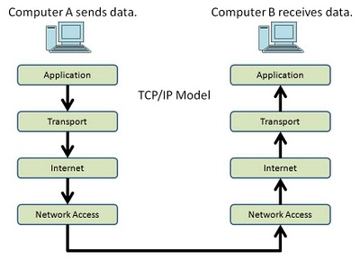

resources

[Cheat Sheet](./network-security-session-cheat-sheet)

[Spec](./rusty-nails-ltd-spec)

---

# Intro to Network Security

---

# Life of a Packet

---

# Devices being used

Firewall

Router

Switch

---

# VLANs and Subnets

VLANs are network configs to break larger networks into virtually separate networks

Subnets are segments of larger networks

---

luhack.uk/w18

---

# Remember

All issues with networks can be traced back to layer 8

---

# Demo

I'm going to show you how to set up a switch and a firewall, these bits are going to be important. 