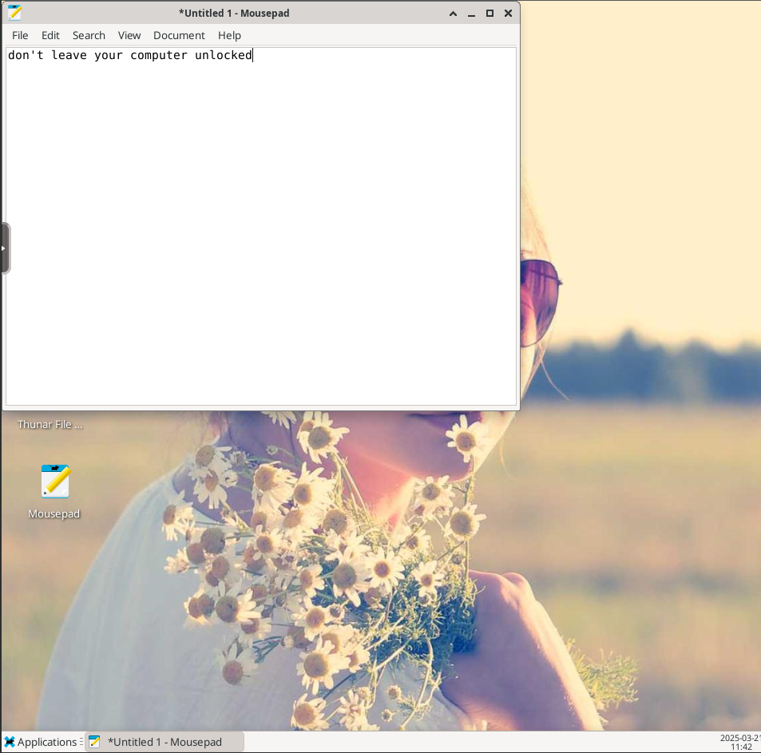

# BadUSB

---


Some people like to leave their laptops unattended and unlocked.

---

Friends don't let friends do this.

Educate them*.

*_Without_ breaking the CMA

---

If you know your friend is going to be gone for a while,
you don't need to worry about them seeing you do this.

What if they've only left the room briefly?

---


Not all keyboards look like keyboards.

---

Go back to the picture slide whilst you tell the story.

---

Whether for fun or for profit, quickly executing a series of keystrokes or mouse movements can be a powerful tool.

(You can also use it to set up a room full of machines which you don't have admin access to.)

---


The USB Rubber Ducky is a tool for executing keystrokes.

---

Today Sally has left her computer unlocked and unattended.

Isaac has built you a BadUSB tool to execute keystrokes and mouse movements.

---

```
key_up <key>
ku <key>

key_down <key>
kd <key>

key_press <key>
press <key>
p <key>
```

---

```
mouse_up <button>
up ...
mu ...

mouse_down <button>
down ...
md ...
```

---

```
type_key <interval> <key1> [key2] [key3] ...
tk ...

type <interval> <text>
t ...
```

---

duration is in seconds

```
sleep <duration>
s ...
wait ...
pause ...
```

---

```
scroll <wheel_clicks> [h | v]

scroll_vertical <wheel_clicks>
sv ...

scroll_horizontal <wheel_clicks>
sh ...
```

---

```
move <relx> <rely> [duration]
mouse_move ...
m ...

move_to <absx> <absy> [duration]
mouse_move_to ...
goto ...
mt ...

click <button> [times] [interval]
mouse_click ...
c ...
```

---

Examples of things you can do to educate Sally

---

Leave a helpful message



---

Take a screenshot of the desktop, set it as the new background, delete all the icons, and hide the taskbar.


(I promise I actually did this here and didn't just take a screenshot of the desktop...)

---

- Open a browser and search for "how to lock my computer when I'm away".
- Go to accessibility settings and turn on sticky keys.
- Go to accessibility settings and increase the delay between clicks for a double-click.
- Look through their files and open a random one (and maybe send it to your C2 server).
- Draw a pretty picture in paint.

---

Go forth and educate!

- [cheatsheet](./cheatsheet)
- [session]()

_Don't forget to save your script before you run it_

[//]: # (TODO: Add link to session)
