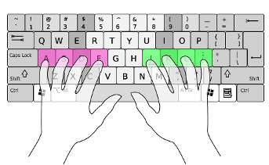
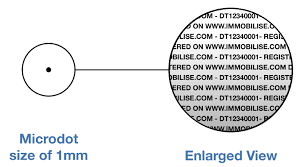
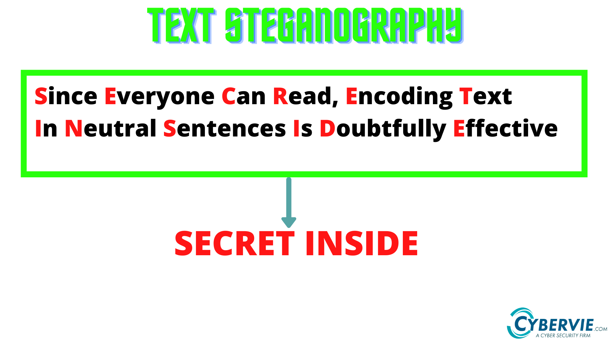

# Stenography

An intro to how to type correctly

---

# What is Stenography

---

# Vim's utter superiority

---

# Insert hilarious joke here

---

# **Steganography**

The art of hiding things in plain sight

---

# What is Steganography?

---

# Examples of Steganogrpahy

- Photos
- Music
- Videos
- OpenXML

---

# Microdot

---

# Text steganography

---

# Music

I mean most music nowadays must be trying to subliminally tell you something.

Have you heard some of the shit on the radio? 

---

# Photos

Photos can be used to layer other images within them.

All images will contain some level of MetaData, known as EXIF.
