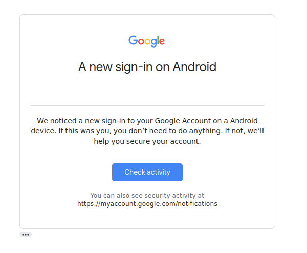
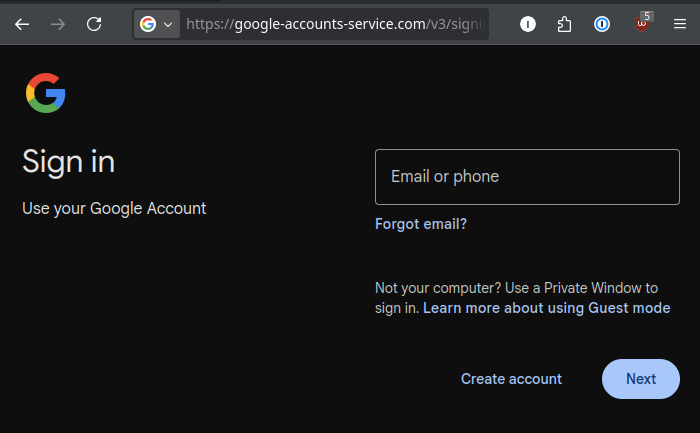
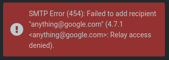

# Phishing and Social engineering

---

Social engineering is the art of hacking people

influencing people to do things and reveal private information.

---

Phishing is a textual form of this, normally sent through email.

There are several more-specific types, as phishing of a term has expanded to all social mediums

- Text messages (Smishing)
- Phone calls (Vishing)
- QR Codes (Quishing)

---

Most phishing attacks get you onto an attacker controlled website by manipulating you to click on a link

---

Then trying to convince you that you are actually on the legitimate page, where any login details get stolen by the attacker.

---

# Spear Phishing

<!-- Today we will be focusing on a different variant called spear phishing -->

These are targeted attacks trying to get information, personalising each email with discovered information.

They may pose as legitimate customers, service providers or someone else.

---

# Tonight's session

Tonight, you will be sending us phishing emails, acting as the red team,
trying to get us to leak information about us, where we work, and our proprietary information

---

# DOs and Don'ts

We will all be using an isolated email server, so we are restricted to a safe environment.

DO NOT try and send emails in from anywhere but session.luhack.uk, especially your uni account

---

# DOs and Don'ts

Stick to spear phishing, and probing for information:

Please do not send us any malware

---

# Troubleshooting

You will not be able to send email outside of our sandbox.

This error is from our mail server, saying that you can't deliver messages to outside of our sandbox

For other errors, retry delivery (click send again), and if that doesn't work, please let us know.

---

# Getting started

Email Client: https://session.luhack.uk

Open the email frontend, and click sign up on the left to start with our free email provider `free.mail`

---

# Registering a domain

As well as freemail, we have a contract with ICANT, allowing you to register domains of your own

Either come up to the front and speak to us, and we will get you set up with a domain, allowing anyone to create emails on there!

---

# Restricted names:

- No "offical" domains, .gov, .edu (unless you phish ICANT for them 😉)

---

# Top Tips

- have fun!
- urgency is key
    - if the email looks important and time sensitive, people might not spend as long reading as they should.
- listen to what they have to say: it might reveal your next plan of attack
- reference job-role relevant stuff
    - maybe imagine what their coworkers could be talking about

---

Get started:

https://luhack.uk/w2

You may want to start by emailing `m.clarke@doe.gov.rh` (easy) or `tam.green@systemx.rh` (hard)

domain registrar: come to the front, or email `namemaster@icant.org`

| **Department of Education – Objective** | **Rheged Systems Services – Objective** |
|----------------------------------------|------------------------------------------|
| Where do they volunteer? | What is the key selling point of the company's services? |
| What do they do there? | How many clients do they have? |
| What type of "old-school" stationary do they like? | Is their backup solution reliable? |
| What activity do they do for charity? | Where are their email services hosted? |
| What is their role called internally? | What is their boss's email address? |
| What materials are they currently preparing? | When was the last time they performed a test on their backup solution? |

