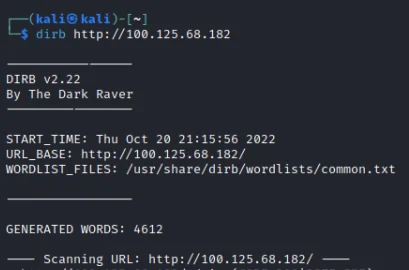
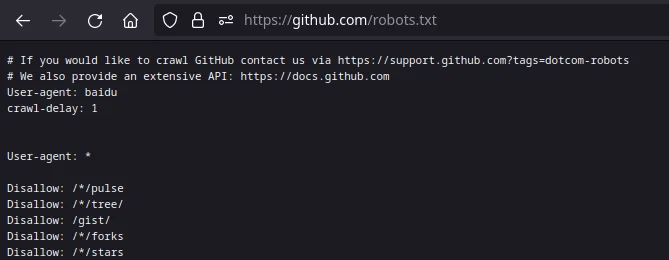
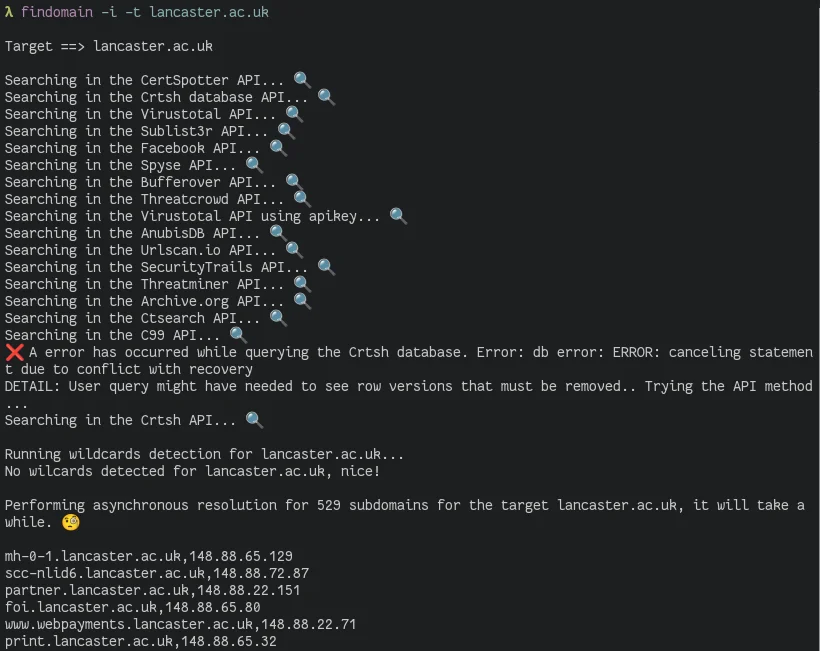
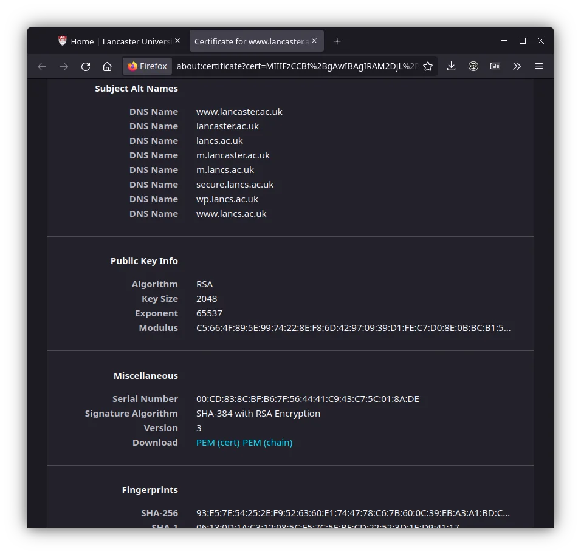
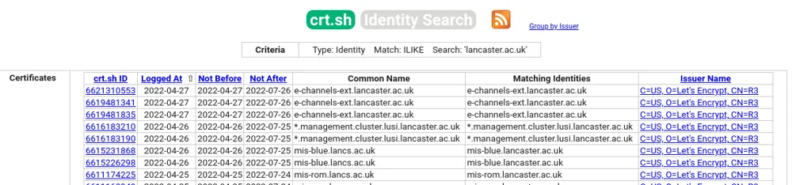
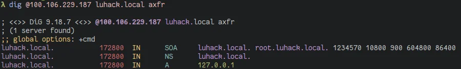

<style>
img{
    height:70vh;
}

p.slide-index-18:nth-child(75) > img:nth-child(1){
height:20vh !important;}

p.slide-index-19:nth-child(75) > img:nth-child(1){
height:20vh !important;}
</style>

# Enumeration


---

# What is enumeration?

Enumeration is gathering context specific information about a system and its users\, and putting any existing information you have into context.

This gathered information is then used to assist with and enable exploitation of vulnerabilities in a system\.

---

# What are we looking for?

- Users
- Groups
- Web pages
- FTP server
- Subdomains

---

# Website enumeration


<div>
<div style="display: grid; grid-columns: auto auto">
<div style="grid-column: 1/2">
The `dirb` command of kali can be used to try many common sub-pages of websites.
 
</div>
<div style="grid-column: 2/3">
<div style="display: flex; justify-content: center;padding:3em">
<br>
</div>
<i>Be aware that this isn't particularly stealthy and you're also tapping in the dark </i>
</div>
</div>
</div>

---

Sometimes website authors think that adding a directory to the robots\.txt file
\(intended to instruct good\-faith bots what not to scan\) prevents malicious people accessing their private pages\.



---

# Enumerating Subdomains

Discovering subdomains can reveal a great amount of information about a target\.
Many websites and other http services are hosted behind reverse proxies which use the Host header to select which back\-end to proxy to\.
There are a couple of ways to discover subdomains\, such as examining TLS certificates\, querying DNS servers\, brute forcing\. Lots of tools to automate this\.

As an example we will use lancaster\.ac\.uk

---

# Findomain, sublist3r, etc

Brute force approach\, queries many different APIs for subdomains\, optionally resolves the IPs these domains point to\.



---

# Subdomains from Certs



---

- Subject Alt Name \(SAN\) in Certs
- Certificate Transparency \(CT\) Logs
  - Certs added to log when issued\, can view all certs issued to a domain
  - Maintained by Google\, Cloudflare\, Digicert etc\.
  - Check:  
      - _[https://transparencyreport\.google\.com/https/certificates](https://transparencyreport.google.com/https/certificates)_
      - _[https://blog\.cloudflare\.com/introducing\-certificate\-transparency\-and\-nimbus/](https://blog.cloudflare.com/introducing-certificate-transparency-and-nimbus/)_
      - _[https://crt\.sh/](https://crt.sh/)_

---



---

# FTP Enumeration

FTP is used to transfer files from a server to other computers
Some servers have anonymous login enabled

```
Username: anonymous
Password: \<anything/blank>
```

Can also brute force credentials using Hydra:

`hydra -L <user list> -P <pass list> -vV <IP> ftp`

`/usr/share/wordlists/rockyou.txt` is a huge pw list

---

# DNS

“Normal” DNS query:

`dig @server <query type (A|AAAA|MX|TXT|CNAME|...)> domain`

Zone Transfer

Transfer an entire zone file, can reveal ALL records 😎

`dig @server axfr domain.com`




# Quick sidenote

A  __huge__  amount of products are shipped with insecure default settings and credentials\.
It may seem obvious to change these\, but companies developing IoT devices just don’t care to allow the end user to change them\.
Often possible to bypass fancy hacking by just investigating default settings and credentials for a target device\.
The mirai botnet compromised millions of devices with a wordlist of only 60 users and passwords:  _[https://github\.com/danielmiessler/SecLists/blob/master/Passwords/Malware/mirai\-botnet\.txt](https://github.com/danielmiessler/SecLists/blob/master/Passwords/Malware/mirai-botnet.txt)_

---

# Useful Links

_[https://www\.virustotal\.com/\#/home/upload](https://www.virustotal.com/#/home/upload)_
_[https://searchnetworking\.techtarget\.com/definition/SNMP](https://searchnetworking.techtarget.com/definition/SNMP)_
_[https://www\.geeksforgeeks\.org/simple\-mail\-transfer\-protocol\-smtp/](https://www.geeksforgeeks.org/simple-mail-transfer-protocol-smtp/)_
_[https://censys\.io/](https://censys.io/)_
_[https://www\.shodan\.io/](https://www.shodan.io/)_
_[https://cirt\.net/passwords](https://cirt.net/passwords)_
_[https://tools\.kali\.org/password\-attacks/hydra](https://tools.kali.org/password-attacks/hydra)_
_[https://haveibeenpwned\.com/](https://haveibeenpwned.com/)_

---

# Lets start hacking

Challenges on:  _[https://luhack.uk/w3](https://luhack.uk/w3)_
