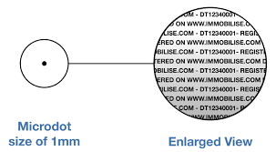

# Steganography

The art of hiding things in plain sight

---

# What is Steganography?

---

# Examples of Steganogrpahy

- Photos
- Music
- Videos
- OpenXML

---

# Microdot

---

# Text steganography

---

# Music

I mean most music nowadays must be trying to subliminally tell you something.

Have you heard some of the shit on the radio? 

---

# Photos

Photos can be used to layer other images within them.

All images will contain some level of MetaData, known as EXIF.

---

# luhack.uk/w7

## You may want some tools.
We recommend keeping the following in mind:
- zsteg (ruby gem, using wsl on windows)
- steghide
- gimp
- https://www.sonicvisualiser.org/
- ImageMagick (install via wsl on windows)
- https://www.aperisolve.com
- exiftool
- Stegsolve
