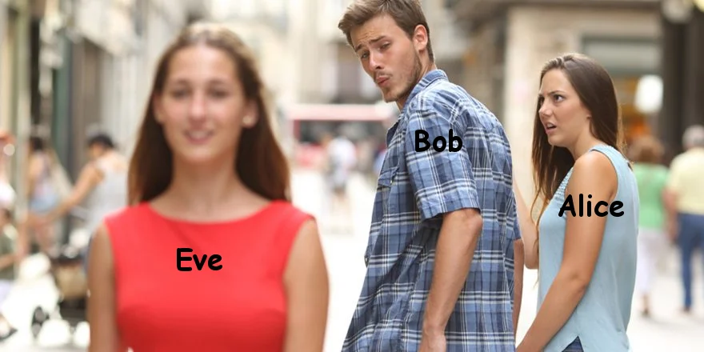
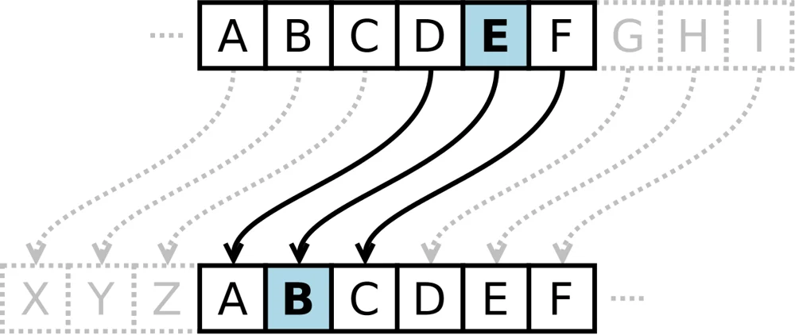
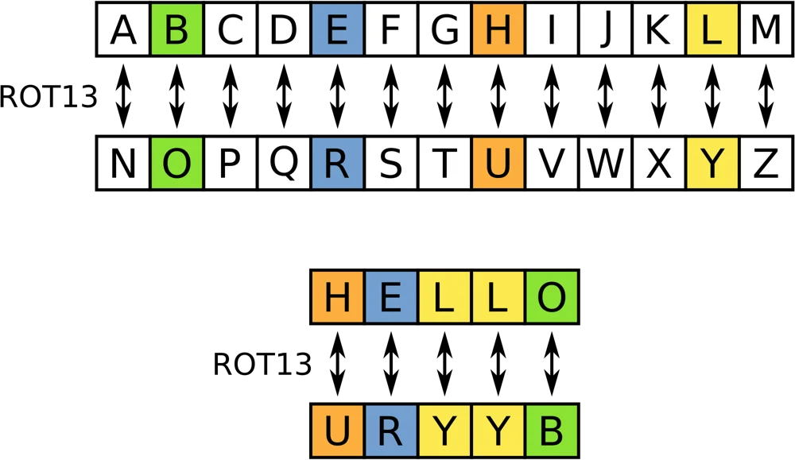
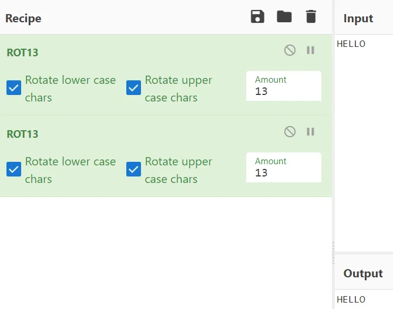

# Cryptography

## Ciphers, encryption and hashing

---

# What is cryptography?

Essentially converting a message (plaintext) into a form that cannot be read (ciphertext) without knowing the method or keys used to get from one form to the other.

Word is from Ancient Greek, meaning “secret writing”.

NOT hiding the existence of messages, that is Steganography (Invisible Ink, Micro Dots, embedding files in images, clandestine communication channels....)

---

# Kinds of Cryptography

Classical Ciphers (Caesar, ROT13)

Hashing (if the hash algorithm is cryptographic: md5, sha512)

---

# Classical Ciphers

Normally just some kind of rule of swapping the letters in the alphabet around.

---

# Classical Ciphers - Caesar Cipher

Simply rotates the alphabet round a set amount, I.e. A -> B, B -> C…

Very few keys - only 26! So easy to work out plaintext by bruteforce!

---

# Classical Ciphers - Caesar Example

__EBIIL, TLOIA!__

What is the plaintext?

__HELLO, WORLD!__

__Not very hard! Look out for distribution of letters (E,T, & A) are the most common, double letters help too!__

---

# Classical Ciphers - ROT13

Chops the alphabet in half, no key this time!

---

One warning, however: ROT13 + ROT13 = Plaintext again!

---

# Hashing

A hashing function is a “one way” function

It maps an input to an output, but with no way of determining the input from an output because of “hard maths”

If two different inputs have the same output “hash”, then this is a collison

Cryptographic: MD5, SHA1, SHA256, Blowfish, BCrypt

Non cryptographic: SeaHash, MurMurHash, FNVhash

---

# Hashing: hard maths

Imagine a function which outputs a number when we give it different words

f(“hello”) = 5

f(“world”) = 5

f(“luhack”) = 6

Clearly this is a very bad hashing algorithm since it gives us a lot of information about the plaintext (the length)

---

What if we turned each letter into a number (a=1, b=2) and multiplied them all together?

f(“hello”) = 8 * 6 * 12 * 12 * 15 = 103680

f(“world”) = 23 * 15 * 18 * 12 * 4 = 298080

f(“luhack”) = 12 * 21 * 8 * 1 * 3 * 10 = 60480

This is a little better, since you can’t see tell much about the words from the hash immediately, but you could start to work it out…

You might also have lots of collisions

---

# Hashing

If we cannot “reverse a hash”, how do we find out the input from an output?

__We can use a brute-force approach, work out the hash values of lots of data we think it might be, and see if any match__

__John and hashcat do this on Kali, websites also available for this__

__(we’ll come back to this)__

---

dd4b112ffcadf9726879197ff24b88c0

What is the plaintext of this hash? \[Hint: MD5\]

---

# Encodings

Encodings are used to represent binary data as ASCII to make it readable

Lots of encodings available: Base\[2,10,32,58,64,85\]

“Binary” is Base 2, “Decimal” is Base 10, “Hexadecimal” is Base 16

Another very important skill in CTFs is recognising data that has been encoded

---

Plaintext: Hello World

Base 32: `JBSWY3DPEBLW64TMMQ======`

Base 64: `SGVsbG8gV29ybGQ=`

Base 85: `87cURD]i,"Ebo7`

Base 65536: `驈ꍬ啯ꍲᕤ`

---

# Context

We will be putting this into practice via a fictional scenario.

---

- Republic of Rheged (us) is in a state of cold war with the Kingdom of Deira (them)

- The CIA of Deira is called the Ministry Of InterNational Intelligence Gathering, or MOINIG

---

# [luhack.uk/w2](https://luhack.uk/w2)

https://gchq.github.io/CyberChef/

https://luhack.uk/article/dns-packet/
